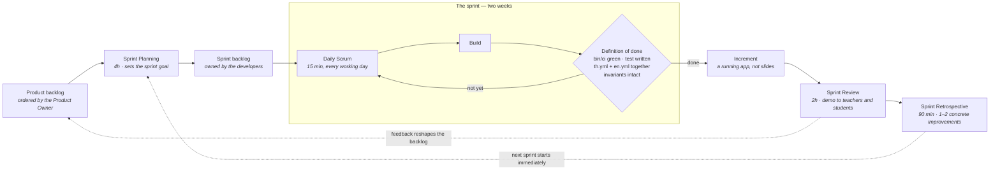

# UTCC AI Academy by Upperclassman

A learning platform for UTCC students getting started with AI — a course catalog, lessons that grade an exercise and a coding task as you go, and progress that follows you across the app. Thai-first interface with an English toggle.

Rails 8.1 · Ruby 3.4.10 · SQLite · Hotwire (importmap, no Node)


---

## Contents

- [Getting started](#getting-started)
- [Everyday commands](#everyday-commands)
- [The screens](#the-screens)
- [Accounts and roles](#accounts-and-roles)
- [Language](#language)
- [Design](#design)
- [How we work](#how-we-work)
- [Technical overview](#technical-overview)
  - [Stack](#stack)
  - [Repository layout](#repository-layout)
  - [Request path](#request-path)
  - [Data model](#data-model)
  - [Progress: the one thing that is recorded](#progress-the-one-thing-that-is-recorded)
  - [Placeholder content: the app's central pattern](#placeholder-content-the-apps-central-pattern)
  - [Authentication and authorization](#authentication-and-authorization)
  - [Routing](#routing)
  - [Views and layouts](#views-and-layouts)
  - [Frontend](#frontend)
  - [Internationalisation](#internationalisation)
  - [Infrastructure](#infrastructure)
  - [Tests and CI](#tests-and-ci)
- [What is real, and what is not](#what-is-real-and-what-is-not)

---

## Getting started

```bash
bin/setup      # install gems, prepare the database, then start the server
bin/dev        # start the server on http://localhost:3000
```

Use `bin/dev` rather than `bin/rails server` — it runs the Tailwind watcher alongside Puma, so CSS changes actually rebuild.

`bin/setup` seeds four demo accounts (development and test only). Password `utcc2026` for all of them:

| Student ID | Who |
| --- | --- |
| `2011071730001` | student, with a few topics already finished |
| `2011071730002` | student, further along |
| `2011071730801` | instructor |
| `2011071730802` | admin |

## Everyday commands

```bash
bin/rails test                             # run the tests
bin/rails test test/models/user_test.rb:12 # run one test
bin/ci                                     # the full pipeline: lint, security scans, tests (run locally — there is no CI service)
bin/rubocop -a                             # autocorrect style
bin/rails admin:create                     # create or promote an admin
bin/rails instructor:create                # create or promote an instructor
```

## The screens

`/` is two different pages: a marketing landing page for a signed-out visitor, and the course catalog once you sign in. Behind the login there are nine screens — catalog, course, lesson, my learning, profile, knowledge map, progress, leaderboard, instructor — plus `/admin`.

`/profile` ("Edit info") is the account's own details, reached from the avatar menu and from the card on My Learning. It is the only screen where a student changes their own record, and the only place an account acquires an **email address** — sign-up asks for a name, a student ID and a password and nothing else. That matters more than it looks: password reset finds a user by email and by nothing else, so until a student fills this in there is no way to recover their account. Their student ID is shown but not editable, and `role` is not on the form for the same reason it is not on sign-up.

The same screen is where a signed-in student **changes their password**, asking for the current one first. That is deliberately separate from `/reset-password`, which is for someone locked out and needs a working mailer — with SMTP unconfigured there is otherwise no way to change a password at all. A successful change signs the account out everywhere except the device that made it.

Screen state lives in the query string rather than in client-side JS: filter chips, lesson steps, tabs and the selected node on the knowledge map are all plain links, so any view of a screen is a URL you can share.

## Accounts and roles

Students sign in with their **student ID** — 13 digits, as printed on the student card — not an email. Sign-up asks for a name, that ID and a password; an email address is optional and only matters for password reset.

- `/register` — sign up
- `/login` — sign in
- `/forgot-password` — request a reset link (only reaches accounts that have an email)
- `/reset-password/:token` — set a new password

A password is 8–72 characters with at least one letter and one digit, is not one of the handful everyone tries first, and is not the student's own ID.

The landing page is public; everything else requires an account, because `ApplicationController` applies `require_authentication` globally — a new public action must opt out with `allow_unauthenticated_access`.

`users.role` is `student`, `instructor` or `admin`, and admin is a superset of instructor. Sign-up always produces a student. `/instructor` needs staff, `/admin` needs admin, and `/admin` is the only place in the app a role can be granted — so the **first** admin comes from `bin/rails admin:create`. `bin/rails instructor:create` is its counterpart for teaching staff, useful when you would rather not sign in to grant one; it refuses to touch an admin, since admin already includes instructor and writing the role would be a demotion. An admin's home is `/admin`, not the catalog.

No mail delivery is configured in development (`raise_delivery_errors = false`), so reset emails go nowhere. Preview the template at `/rails/mailers`, or grab the reset URL from `log/development.log`.

## Language

Thai is the default locale, English the fallback, and the toggle lives in the header. **Every word a human reads is in `config/locales/{th,en}.yml`** — the Ruby side holds only numbers, taxonomy and shape. The two files are 1:1 in structure, and several values are arrays consumed by index, so a key added to one must be added to the other at the same position.

The toggle posts to `POST /language/:locale` rather than linking to it: Turbo prefetches links on hover, and a GET would switch language just by pointing at the button.

A visitor who has not touched the toggle gets whichever language their browser asks for, and adding `?lang=en` to any URL renders that page in English without changing the setting — which is how a search engine finds the English half of a site whose language is otherwise a session setting.

## Design

Crimson `#A81E32` on cream, IBM Plex Sans Thai, Tailwind v4 through `tailwindcss-rails` (still no Node, no npm).

**`app/assets/tailwind/application.css` is the entire stylesheet and the single source of truth for the visual tokens** — an `@theme` block, a small `@layer base`, and a handful of `@utility` escape hatches for gradients and clip-paths that cannot be expressed as utilities. There are no component classes: recipes are repeated as utilities in the markup, and no hex value belongs anywhere but that `@theme` block. Read it before making visual changes.

`docs/design-system.md` documents the **earlier** port from [eng.utcc.ac.th](https://eng.utcc.ac.th) (maroon, Noto Sans Thai Looped, daisyUI anatomy). The app UI has since moved on — treat that document as background on the reference site, not as a description of the current tokens.

## How we work

Scrum, on a **two-week sprint**. Scope is negotiable, the deadline is not, and a sprint ends with something that runs.



The backlog's dependency order is complete: ~~Course and Topic tables~~ → ~~submissions~~ → ~~sections/cohorts~~ → ~~projects and awards~~. What is still placeholder — hearts, notifications, per-topic lesson content — is listed under "What is real, and what is not". A good sprint goal takes one placeholder surface and makes it real — a vertical slice that demos at the review.

Full detail, including roles and the time-boxes, is in `docs/process.md`.

---

# Technical overview

## Stack

| Layer | Choice | Notes |
| --- | --- | --- |
| Framework | Rails 8.1, module `UtccAiFundamental` | `config.load_defaults 8.1` |
| Language | Ruby 3.4.10 | `Data.define`, endless methods, `it` block param, pattern matching |
| Database | SQLite (`sqlite3` >= 2.1) | one file in development and test; four in production |
| Web server | Puma, fronted by Thruster in the container | |
| Assets | Propshaft | no Sprockets manifest, no `app/assets/config/` |
| CSS | Tailwind v4 via `tailwindcss-rails` | standalone binary, no npm, no PostCSS |
| JS | importmap-rails + Turbo + Stimulus | no Node, no bundler, no `package.json` |
| Auth | Rails 8 `generate authentication` + `bcrypt` | cookie sessions in a table, no Devise |
| Background jobs | `solid_queue` | in-process under Puma |
| Cache | `solid_cache` | |
| WebSockets | `solid_cable` | nothing uses it yet |
| Deploy | Docker, via Kamal or Render | `config/deploy.yml`, `render.yaml` — one image, two targets |
| Tests | Minitest (**not** RSpec), parallel | Capybara + selenium drive the system tests |
| Lint / security | `rubocop-rails-omakase`, Brakeman, bundler-audit, `importmap audit` | all wired into `bin/ci` |

There is **no Redis, no Memcached and no separate job runner** — every piece of infrastructure is a SQLite database.

## Repository layout

```
app/
  assets/tailwind/application.css   the whole stylesheet: @theme, @layer base, @utility
  controllers/
    concerns/authentication.rb      Current.user, require_authentication, session cookie
    concerns/authorization.rb       the allow_only macro
  helpers/application_helper.rb     nav items per role, footer columns per session
  javascript/controllers/           Stimulus, auto-registered by filename
  models/                           six Active Record classes; the rest are placeholder modules
  views/
    layouts/application.html.erb    app chrome
    layouts/auth.html.erb           split-screen sign-in/sign-up/reset
    shared/                         header, app header, footer, auth hero, language toggle
config/
  ci.rb                             the pipeline bin/ci runs
  locales/{th,en}.yml               every word a human reads
  routes.rb                         one line per verb, plain-English URLs
db/
  schema.rb                         users, sessions, courses, course_modules, topics, topic_completions
  {queue,cache,cable}_schema.rb     the solid_* databases, kept separate on purpose
  seeds.rb                          fenced to Rails.env.local?; must stay idempotent
lib/tasks/roles.rake                bin/rails admin:create, bin/rails instructor:create
docs/design-system.md               background on the earlier eng.utcc.ac.th port
```

## Request path

Every request goes through `ApplicationController`, which is short and does four things:

```ruby
class ApplicationController < ActionController::Base
  include Authentication      # adds a global before_action :require_authentication
  include Authorization       # after Authentication, so /login wins over a role redirect
  allow_browser versions: :modern
  stale_when_importmap_changes
  around_action :switch_locale
  helper_method :progress     # the header's gem and streak counters, on every screen
end
```

`progress` is `Current.user&.progress || LearnerProgress.new(nil)` — a null-object fallback so the helper is safe on the one screen that renders without a user.

Controllers below it are deliberately tiny: read a param, validate it against a whitelist, ask a module, assign. `ProgressController` is 238 bytes; `LeaderboardsController` is 154. **A param is never trusted and never raises** — each controller falls back to a default (`CourseCatalog::FILTERS.include?`, `LessonContent.step_for`, `Leaderboard.tab_for`, `AdminConsole.tab_for`). `AdminConsole.tab_for` matters twice over: the tab name is interpolated into a `render` path, so anything but a whitelisted value would be a template-injection foothold.

## Data model

Nine tables. That is the whole schema (`db/schema.rb`, version `2026_07_26_093004`):

**`users`** — `student_id` (unique, 13 digits, normalised to lowercase and stripped), `name`, `password_digest`, `role` (default `"student"`, not null), optional `email_address` (unique), `faculty`, `study_year`.

```ruby
enum :role, ROLES.index_by(&:itself), default: "student", validate: true
```

`validate: true` is deliberate: the admin form posts a role from params, and without it an unknown value raises `ArgumentError` instead of failing validation.

**`sessions`** — `user_id`, `ip_address`, `user_agent`. Rails 8's generated authentication: the cookie holds a session id, so signing out is a row deletion.

**`courses`** — `code` (unique), `position` (unique, catalog order), `credits`, `rating`, `projects`, `hours`, `level`, `core`, `certificate`, `tags` (json), `learners`. Identity, taxonomy and numbers only; every word a human reads is still `catalog.courses.<code>.*` in the locale files.

**`course_modules`** — `number` (unique), `units`. **`topics`** — `course_module_id`, `position`, `key` (unique), `kind`, `minutes`. Six modules, fifteen topics.

A module belongs to **no course**: every course reuses the one shared syllabus, exactly as the constants did before them, so `course_modules.course_id` is the column to add on the day someone writes a second syllabus to put in it. No row carries a status — done / now / locked is derived from what a learner has finished, which is what makes finishing a topic really open the next module.

`topics.key` is `"<module>-<position>"`. Derived from the two columns beside it, but stored and unique because it is the public identifier: it is what `/lesson?topic=2-3` carries.

**`topic_completions`** — `user_id`, `course_id`, `topic_id`, `learned_at` (not null), `applied_at` (nullable). Unique index on `[user_id, course_id, topic_id]`, plus `[user_id, learned_at]` for the activity grid.

One row per learner per topic, carrying both timestamps, because a topic cannot be applied without first being learned and the UI shows them as two bars over the same list. A topic used to be named by **strings** — validated against `CourseCatalog.codes` and `Syllabus.topic_keys`, since nothing else could enforce them. Those validations are foreign keys now, so the rule that a row can never name a course or topic that does not exist is true by construction.

The strings did not go away, they moved:

```ruby
def course_code = course&.code
def topic_key   = topic&.key
```

They are what the browser posts, what `LearnerProgress` folds on, and what the URL carries, so the app's vocabulary is unchanged. `LearnerProgress` loads completions with `includes(:course, :topic)` — three queries whatever the row count.

`TopicCompletion.record` is **idempotent** — a `find_or_initialize_by` that never moves a timestamp already set, and that fills both stamps when the first report is an `applied` one. The exercise and the coding task each report a pass on every run; re-running the lesson writes no second row and inflates no count.

## Progress: the one thing that is recorded

`LearnerProgress` is an ordinary class over those rows, and the worked example of what replacing a placeholder looks like — it kept the reader methods the views already called, so nothing in the views changed when it landed.

It loads a learner's rows **once** and folds them in Ruby rather than aggregating in SQL: the volume is one row per topic per student, the date arithmetic wants `Time.zone` rather than SQLite's, and the screens ask for six different cuts of the same rows.

The display conventions live in the class, not the table:

```ruby
XP_PER_LEARNED = 120     GEMS_PER_LEARNED = 5     XP_PER_LEVEL = 400
XP_PER_APPLIED = 60      GEMS_PER_APPLIED = 10    ACTIVITY_DAYS = 84  # 12 weeks, 28 to a row
```

Keep the gem values in step with the `gems` figures in the `quiz` and `code_task` Stimulus controllers — the sidebar counter moves client-side before the row is written.

What it derives: per-course counts, `courses` (the catalog with this learner's numbers filled in), the two My Learning tabs, totals and percentages **counted across started courses only**, `minutes_studied` (from the syllabus budget — wall-clock time is not recorded), XP, level, gems, `streak` (yesterday still counts as the head of a run), `learned_this_week`, the 84-day activity heat array, `rank` (nil until the learner records anything), and the dashboard's four tiles.

Denominators come from `Syllabus.topic_count` / `applied_topic_count`, not from per-course numbers. Every course therefore shows the same total — deliberate, because a course whose stat tile and progress bar disagreed could never be finished.

Recording is a consequence of grading. `quiz` and `code_task` POST what the student did to `POST /lesson/submit`; `LessonsController#submit` whitelists the kind, checks the topic is unlocked, grades it in `LessonContent`, files a `submissions` row and writes the completion **only on a pass** — `quiz` fills the learned half, `code` the applied one. It answers with the verdict the page renders, and is rate-limited to 30 in 3 minutes.

**`submissions`** — `user_id`, `course_id`, `topic_id`, `kind` (`quiz` | `code`), `answer`, `passed`. One row per **attempt**, where a completion is one row per outcome. Failures are kept deliberately: they are what the instructor report's "share failing on first attempt" is counted from.

**`sections`** — `course_id`, `instructor_id` (nullable: a section can be timetabled before anyone is assigned to teach it), `code`, `term`. The term is stored as the registrar writes it — `"1/2569"`, Buddhist year — and `Section#term_text` converts for English readers; data carries no locale. **`enrollments`** — a join and nothing more: how a student is doing already lives in `topic_completions` and `submissions`, and a copy here would be free to disagree with it.

## Placeholder content: the app's central pattern

`app/models/` holds **two** Active Record classes (`User`, `TopicCompletion`, plus `Session`). Everything else is a module of frozen constants and `Data.define` value objects: `CourseCatalog`, `Syllabus`, `LessonContent`, `LearnerProfile`, `KnowledgeMap`, `Leaderboard`, `InstructorReport`, `Proctoring`, `AdminConsole`.

The split inside them is consistent:

- **Ruby holds numbers, taxonomy and shape** — course codes, credits, ratings, percentages, the tree structure, which module is locked.
- **The locale files hold every word.** The `Data` objects reach copy through `I18n.t` in their own methods: `course.title` is `I18n.t("catalog.courses.#{code}.title")`.

```ruby
Course = Data.define(:code, :credits, :rating, :projects, :hours, :level, :core,
                     :certificate, :tags, :learners, :learned, :applied, :next_key) do
  def topics = Syllabus.topic_count
  def title = I18n.t("catalog.courses.#{code}.title")
  def started? = learned.positive?          # no enrol button — the first finished topic is the enrolment
  def completed? = learned >= topics
end
```

⚠️ **Several joins between Ruby and the locale files are positional, not keyed.** `Syllabus::ENTRIES[i]` lines up with `course.modules[i]`; likewise `LearnerProgress::AWARDS`, `LearnerProgress#dashboard_stats`, `LessonContent::BLOCKS`, and every `AdminConsole` array with its `admin.*` counterpart. Inserting a row in one place without the other silently shifts every label after it. `test/models/placeholder_content_test.rb` exists mainly to catch that, and asserts across **both** locales.

Replacing a placeholder with a real model means keeping the same reader methods — the views only ever call those.

## Authentication and authorization

Built on Rails 8's `bin/rails generate authentication`, plus a hand-written `RegistrationsController` since the generator omits sign-up.

- `Current.user` / `Current.session` (an `ActiveSupport::CurrentAttributes`) are how views read the signed-in user; `authenticated?` is the exposed helper, and the layouts branch on it.
- `start_new_session_for(user, remember: true)` backs the "remember me" checkbox — `remember: false` gives a session cookie instead of a permanent one.
- Sign-in, sign-up and password-reset `create` actions are each `rate_limit to: 10, within: 3.minutes`.
- `SessionsController#create` authenticates with `User.authenticate_by(params.permit(:student_id, :password))`.
- `PasswordsController#create` checks `params[:email_address].present?` before looking up — without it, a blank submission would match `email_address IS NULL` and reach one of the many accounts with no address. It always redirects to the same confirmation, so the screen never reveals whether an address has an account.
- `RegistrationsController#user_params` permits `:name, :student_id, :password, :password_confirmation`. **Do not add `:role`** — `test/controllers/registrations_controller_test.rb` fails if you do.

Authorization is a separate concern, included *after* `Authentication` so a signed-out visitor lands on `/login` rather than the catalog:

```ruby
def allow_only(*roles, **options)      # mirrors allow_unauthenticated_access:
  before_action(**options) { authorize_role(roles) }   # it names who is let in
end
```

Any `User` predicate works — `allow_only :staff` on `InstructorController` (staff is `instructor? || admin?`), `allow_only :admin` on `AdminController`. Denial is a redirect to `root_path` with a flash, matching how `CoursesController#show` handles an unknown course code.

`ApplicationHelper#app_nav_items` is built from the role, so a missing gate shows up as a link nobody can use. An admin gets a **different list entirely** (`admin_nav_items`) rather than the learner nav with staff entries bolted on. The desktop rail and the burger drawer both read that one list.

## Routing

Auth URLs read as plain English rather than as REST resources, and each screen has **one** helper covering both its GET and its POST — `login_path` is the form action as well as the link to it.

```ruby
get/post "login"                 → sessions#new/create        # login_path
delete   "logout"                → sessions#destroy
get/post "register"              → registrations#new/create   # register_path
get/post "forgot-password"       → passwords#new/create
get/put  "reset-password/:token" → passwords#edit/update

post "language/:locale" => "languages#update", constraints: { locale: /th|en/ }

resources :courses, only: :show, param: :code   # /courses/AI1101
get  "lesson"          => "lessons#show"        # ?step=theory|exercise|code|summary
post "lesson/submit"   => "lessons#submit"
get   "my-learning"    => "my_learning#show"    # ?tab=progress|done
get   "profile"        => "profiles#edit"       # the account's own details
patch "profile"        => "profiles#update"     # the only place an email is set
patch "profile/password" => "profiles#update_password"  # change it while signed in
get   "map"            => "knowledge_maps#show" # ?topic=<node id>&mode=course|project
get   "progress"       => "progress#show"
get   "leaderboard"    => "leaderboards#show"   # ?tab=week|semester|university
get   "instructor"     => "instructor#show"
get   "admin"          => "admin#show"          # ?tab=features|overview|users|courses|queue|audit
patch "admin/users/:id" => "admin#update"
get   "up"             => "rails/health#show"

get "privacy"     => "policies#privacy"         # public — the PDPA notice
get "terms"       => "policies#terms"           # public — terms of use
get "robots.txt"  => "crawlers#robots"          # public — rendered, not a file in public/
get "sitemap.xml" => "crawlers#sitemap"
get "llms.txt"    => "crawlers#llms"

root "home#index"                               # catalog / admin / landing
```

The generator's old auth URLs (`/session/new`, `/passwords/:token/edit`, …) survive only as `redirect()`s so reset links already in inboxes still resolve; nothing in the app links to them.

### What a crawler reads

The last three are for machines, and they are rendered rather than checked into `public/` because each one has to name absolute URLs and the app has no configured host — only the request knows where the site lives. `CrawlersController::DISALLOWED` is the private half of the app written out for `robots.txt`, and the sitemap is tested against it so a path can never be advertised and closed at once; `layouts/auth` adds `noindex, nofollow` on top, because robots.txt stops a crawl but not an indexing. `AI_AGENTS` names the model crawlers and hands them the wildcard group's rules verbatim; a group written by name replaces the wildcard rather than adding to it, so repeating the rules is what keeps them equal. `llms.txt` is the one page in the app with a single language — it is always English, because it is read by models rather than by students — and everything in it comes from `Landing`.

The sitemap lists every page **once per language**, and each entry names the whole hreflang set including itself, since a cluster that does not name itself is discarded rather than read partially. `shared/_meta` publishes the same set as `<link rel="alternate">` with an `x-default` pointing at Thai, and a page's canonical is the URL of that translation rather than of the path.

Pages also publish JSON-LD: the school on every page from `shared/_meta`, and on the landing page a `FAQPage`, an `ItemList` of `Course` and an `ItemList` of `Event`, added with `content_for :schema` (see `SchemaHelper`). All of it is built from the same reader methods the sections on screen use, so it is translated with the page. Only events with a date in `Landing::EVENTS` are published — `Event` without a `startDate` is invalid rather than vague, and "every Wednesday" is not a date.

## Views and layouts

Two layouts, sharing `shared/_head`:

- **`layouts/application`** — renders `shared/_app_header` (dark chrome: nav, language toggle, gems and streak counters, notifications, account menu) when signed in, `shared/_header` (marketing) when not. `shared/_footer` closes **every** screen either way; only its first two link columns branch on the session (`ApplicationHelper#footer_columns` — landing anchors signed out, app routes signed in, since `#learn` would scroll nowhere on `/progress`). Its copy lives under `chrome.footer.*`, not `landing.*`, because it is shared chrome.
- **`layouts/auth`** — used by `SessionsController#new`, `RegistrationsController#new/create` and `PasswordsController#new/edit` via `layout "auth", only: …`. No app chrome; a split screen with `shared/_auth_hero` on the left. Note that `only:` matches the **action**, not the template: `#create` is in the list because it re-renders `:new` when sign-up fails.

## Frontend

Add JS dependencies with `bin/importmap pin <pkg>` — never npm or yarn. It writes `config/importmap.rb` and vendors into `vendor/javascript`. Stimulus controllers are auto-registered by `pin_all_from`, and **the filename determines the identifier**.

| Controller | What it does |
| --- | --- |
| `header` | sticky header, mobile drawer |
| `dropdown` | notifications, account menu |
| `tabs` | segmented controls that navigate |
| `panels` | tabs whose panels are all already in the document — show/hide, optionally pushing a path and title |
| `quiz`, `code_task` | in-browser lesson grading |
| `rewards` | listens for the reward events those two emit, POSTs the completion |
| `proctor` | lesson integrity monitoring |
| `to_top` | back-to-top button |

Accordions are native `<details>` — no controller.

**State travels on `data-*` attributes and is read by Tailwind variants** (`data-[state=correct]:`, `data-[open=true]:`, `group-open:`, `aria-selected:`). Controllers set an attribute; they do not juggle class lists. Keep it that way when adding interaction. `header_controller` is the exception that proves the rule: it receives its pinned state as *several* utilities via `data-header-pinned-class`, so it uses `classList.add/remove(...this.pinnedClasses)` — `classList.toggle` takes only one class and will silently break if you switch back to it.

`proctor_controller` mounts only for `Current.user.student?`; staff get the same bar with the controls inert. The sidebar score is per-page, but every incident is posted to `lesson/incident` and kept in `proctor_events` — the admin Integrity tab reads the record, and closing a case stamps the events reviewed. The log row is a `<template>` in the view, cloned per incident, so no markup lives in JS.

**Lesson grading runs on the server.** The `quiz` and `code_task` controllers send what the student did to `POST /lesson/submit` and render the verdict they get back; neither knows the answer key. They share the posting helper in `app/javascript/grading.js`, which sits outside `controllers/` because `pin_all_from` would otherwise register it as a Stimulus controller. The coding task's criteria light up when the run answers rather than as you type — live ticking would need the patterns in the page.

## Internationalisation

```ruby
config.i18n.default_locale = :th
config.i18n.available_locales = %i[ th en ]
config.i18n.fallbacks = [ :en ]        # a key missing from th.yml renders English rather than raising
```

`ApplicationController#switch_locale` is an `around_action`, and three sources decide which language a page renders in — **`?lang=`, then `session[:locale]`, then the browser's `Accept-Language`**, with Thai only when none of them match. The toggle writes the session one through `LanguagesController#update`, whose route constraint `/th|en/` means an unsupported locale 404s at the router and never reaches `I18n`. The toggle partial takes a `dark:` local because it renders both on chrome and on light surfaces.

`?lang=` is read for one request and never written to the session. It exists so each translation has a URL of its own — one that can be linked, canonicalised and paired in an hreflang — and `ApplicationHelper#locale_url` is the only place that builds them: the default locale keeps the bare path, so `/` is Thai and `/?lang=en` is the same page in English. Making the param stick would reintroduce the problem the POST toggle route exists to avoid, since Turbo prefetches links on hover.

## Infrastructure

- In production the solid_* adapters live in **separate SQLite databases** (`storage/production_{queue,cache,cable}.sqlite3`), declared as extra entries under `production:` in `config/database.yml`, each with its own `migrations_paths`. Their schemas are `db/{queue,cache,cable}_schema.rb` — **do not fold these into `db/schema.rb`**.
- Development and test use a single `storage/development.sqlite3` / `storage/test.sqlite3`; the solid_* adapters are only wired up in `config/environments/production.rb`.
- Workers run **in-process**: `config/puma.rb` loads `plugin :solid_queue` when `SOLID_QUEUE_IN_PUMA` is set, which `config/deploy.yml` sets. `bin/jobs` runs the supervisor standalone; recurring jobs go in `config/recurring.yml`.
- `storage/` is a persistent Docker volume — that is where the production SQLite files live. **A deploy target that does not mount it has no database that outlives a push**: `bin/docker-entrypoint` runs `db:prepare` before the server, so an unmounted `storage/` is silently recreated empty on every release, taking the users, sessions and completions with it.
- `assets:precompile` builds Tailwind first, so the Dockerfile needs no extra step.
- `RAILS_MASTER_KEY` decrypts `config/credentials.yml.enc`, and `secret_key_base` is in there — so the variable is not optional in production, it is what lets the app boot at all. `config/master.key` is gitignored and therefore never in the image; the target has to supply the value. `config/deploy.yml` still carries the placeholder server `192.168.0.1` and registry `localhost:5555`.
- **`config.assume_ssl` and `config.force_ssl` are on in production**, which makes `proxy: ssl: true` in `deploy.yml` part of the same decision rather than an option. Kamal's proxy terminates TLS and speaks http to Thruster, so without `assume_ssl` Rails believes every request arrived unencrypted — and `request.base_url` is what builds every canonical, hreflang and sitemap URL the app publishes. `/up` is excluded from the https redirect so the proxy and uptime monitors can still reach it.
- **The production site is `https://academy.boring9.dev`**, and that name is written down in three places that have to agree: `config.hosts` (what the app will answer to), `config.action_mailer.default_url_options` (the only URLs not built from a request — the password-reset link) and `domains:` in `render.yaml` (what Render issues a certificate for). A mismatch between the first and the third is a 403 on your own domain, not a redirect.
- Still to fill in: **SMTP**. `config.action_mailer.smtp_settings` is commented out, so the password-reset mail is composed and enqueued and then goes nowhere — the one user-facing feature that is not actually working in production. `ApplicationMailer`'s `from:` is `no-reply@academy.boring9.dev`, which will need to be an address the eventual provider is allowed to send as.
- Kamal's own placeholders are untouched — `servers.web` is still `192.168.0.1`, the registry `localhost:5555`, and the `proxy` block still commented. That is fine while Render is the live target; it does mean `config/deploy.yml` is not a description of where the site runs.

### Render

`render.yaml` is a blueprint for the same Dockerfile, kept in the repo so the two settings that are easy to get wrong cannot drift into the dashboard:

- the **disk** mounted at `/rails/storage`, which needs a paid instance type — a free one has no disk option, and see the `storage/` note above for what that costs;
- the **port pair**, `HTTP_PORT` and `PORT`, both `10000`. `HTTP_PORT` is what Thruster listens on and `PORT` is how Render knows where to route; Thruster then hands Puma its own `PORT` (3000) inside the container, so setting only one of the two leaves Render routing to a port nothing is bound to.

`RAILS_MASTER_KEY` is declared `sync: false` — Render prompts for it and stores it, and it is never written to this file. `numInstances` stays at 1 because SQLite takes one writer. Render terminates TLS itself and forwards `X-Forwarded-Proto`, so `assume_ssl` is as correct here as it is behind Kamal's proxy.

## Tests and CI

Minitest, run in parallel (`parallelize(workers: :number_of_processors)`), loading all fixtures — keep tests isolated from shared mutable state. `test/test_helpers/session_test_helper.rb` provides `sign_in_as(user)` and `sign_out`, auto-included into integration tests.

| File | Covers |
| --- | --- |
| `controllers/app_screens_test.rb` | every signed-in screen renders, bad params fall back, every route redirects to login when signed out |
| `controllers/admin_test.rb` | the role gate and the only place a role is granted |
| `controllers/lesson_completion_test.rb` | the browser-to-record seam, and that a completion then shows on the screens that count it |
| `controllers/registrations_controller_test.rb` | sign-up, including that `:role` can never be mass-assigned |
| `controllers/languages_controller_test.rb` | the locale switch sticks across requests; an unroutable locale 404s |
| `controllers/locale_negotiation_test.rb` | which of `?lang=`, the session and `Accept-Language` wins, and that `?lang=` never sticks |
| `controllers/crawlers_test.rb` | robots.txt, the sitemap and llms.txt agree about what is public |
| `controllers/indexing_test.rb` | canonicals, the hreflang set, and which pages ask not to be indexed |
| `controllers/structured_data_test.rb` | the JSON-LD each page publishes, in both locales |
| `models/placeholder_content_test.rb` | derived values and the positional locale wiring, in **both** locales |
| `models/learner_progress_test.rb`, `topic_completion_test.rb` | every counted figure, and what the table will and will not accept |
| `tasks/admin_task_test.rb` | `admin:create`, including promotion of an existing account |
| `tasks/instructor_task_test.rb` | `instructor:create`, including that it leaves an admin alone rather than demoting one |
| `models/instructor_report_test.rb`, `models/leaderboard_test.rb` | the Teaching console and the board, counted from a real section |
| `models/awards_test.rb` | one test per award rule, and that a new account has earned nothing |

Assertions compare against `I18n.t(...)` rather than literal strings, and are scoped (`assert_select "main h2"`) because the header nav links to AI1101 on every page — a copy change in a locale file should not break a test.

**`test/fixtures/topic_completions.yml` is deliberately empty and must stay present.** Tests that need progress record it themselves; the file exists so fixtures clear the table, because `bin/ci` seeds completions into the test database and those rows would otherwise outlive the users they point at.

**`courses.yml`, `course_modules.yml` and `topics.yml` are the opposite** — they carry the taxonomy, because `db:test:prepare` loads the schema and a schema holds no data. That makes three copies of the same rows that must agree: the `CreateCourses` migration (what production has), `db/seeds.rb` (what restores them after `db:seed:replant` truncates every table) and these fixtures. `test/models/taxonomy_test.rb` asserts the shape they all have to produce, so a row added to one copy and not the others fails a test rather than quietly shortening a syllabus.

`bin/ci` is the whole pipeline — there is no CI service and no GitHub workflow:

```
Setup → Style: Ruby → Gem audit → Importmap audit → Brakeman → Tests: Rails → Tests: Seeds
```

The seeds step runs `db:seed:replant` against the test database, so `db/seeds.rb` must stay runnable against a fresh one. The system-test step runs `test/system/` in headless Edge — one walk of the definition-of-done path: sign in, fail then pass the graded exercise, see it counted.

---

## What is real, and what is not

**Users, sessions, the course taxonomy, sections, progress and submitted work are persisted; the lesson content is not.**

A learner's progress is genuinely recorded — `topic_completions` holds one row per learner per topic, and the catalog, My Learning and the dashboard all count off it. Everything else is placeholder:

- **The learning material is copy, not records.** Courses, modules and topics are rows now, but every word a human reads — titles, prose, topic names — lives in the locale files, and every course still shares the one syllabus, which is why they all show the same topic total.
- **A lesson's *content* is the same whichever topic you open.** `/lesson?course=AI1101&topic=2-3` is a real position in the syllabus: it decides what gets recorded, which module unlocks next, and where "continue" goes. But the prose, the quiz and the coding task behind it are one placeholder set — writing sixteen of them is a content job, not a modelling one.
- **Grading runs on the server**, and every attempt is kept in `submissions`. The answer key and the passing patterns are not rendered, so a pass cannot be claimed by posting one. The quiz verdict does return the correct option so the page can mark it — after a graded, recorded attempt, not before.
- **The leaderboard, the Teaching console, the award shelf and the projects tile are counted** — off `sections`, `enrollments`, `topic_completions` and `submissions`. An award is a derived rule, never stored; one ("Helping Hand") is honestly unearnable until a forum exists. Hearts and notifications are still placeholder, because nothing records a lost life or an event worth notifying about.
- **`/admin` is the exception** — its Users tab is real records and the `role` column, and it is the only screen backed by the database rather than a module. Its other five tabs are placeholder.
- The landing page's content is still hardcoded in `HomeController#index`.

See `CLAUDE.md` for the conventions to follow when changing any of this, and `docs/process.md` for how the team works — sprints, roles, the four Scrum events, and what "done" means here.
