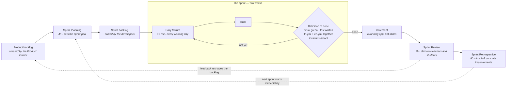

# UTCC AI Academy by Upperclassman


---

## Getting started

You need Ruby 3.4.10 and **Docker**, which runs the database and disposable local email inbox — there is no Postgres or SMTP server to install on your machine.

```bash
bin/setup      # start local infrastructure, install gems, prepare the database, then start the app
bin/dev        # start the server on http://localhost:3000
```

Use `bin/dev` rather than `bin/rails server` — it runs the Tailwind watcher alongside Puma, so CSS changes actually rebuild.

The database is the `postgres:18-alpine` service in `compose.yml`, which `bin/setup` brings up for you; `docker compose up -d` and `docker compose down` start and stop the local services by hand, and `docker compose down -v` also throws the database data away. PostgreSQL listens on **5433**, not the usual 5432, so it cannot collide with another project's Postgres — `config/database.yml` defaults to the same port, and every value in it can be overridden with `DB_HOST`, `DB_PORT`, `DB_USER`, `DB_PASSWORD` if you would rather point at a server of your own.

Development email is delivered over SMTP to the pinned, disposable `mailpit` service. Open [http://127.0.0.1:8025](http://127.0.0.1:8025) to inspect captured messages; SMTP listens only on `127.0.0.1:1025`. Override those host-side ports with `MAILPIT_UI_PORT` and `MAILPIT_SMTP_PORT`, and keep Rails aligned with a custom SMTP port by setting `SMTP_PORT` to the same value. `SMTP_HOST` defaults to `127.0.0.1`. Mailpit has no volume, authentication, or public interface: recreating its container clears captured addresses and reset links. It verifies local application-to-SMTP behavior only; it does not prove production delivery or real-mailbox receipt.

`bin/setup` seeds nine demo accounts (development and test only) — one per role, plus a five-student roster so the Teaching console and the leaderboard have a cohort to be about. Password `utcc2026` for all of them; these are the four worth signing in as:

| Student ID | Who |
| --- | --- |
| `2011071730001` | student, with a few topics already finished |
| `2011071730002` | student, further along |
| `2011071730801` | instructor, teaching section `BA-2` |
| `2011071730802` | admin |

## Everyday commands

```bash
bin/rails test                             # run the tests
bin/rails test test/models/user_test.rb:12 # run one test
bin/docs                                   # validate backlog, Markdown/skill graphs, and lifecycle documents
bin/verify                                 # full local gate; delegates to bin/ci
bin/rubocop -a                             # autocorrect style
bin/rails admin:create                     # create or promote an admin
bin/rails instructor:create                # create or promote an instructor
docker compose up -d --wait mailpit        # start the disposable local email inbox
```

## Development dashboard

[The live development dashboard](https://utcc-ai-academy.vercel.app) renders its current execution status from the machine-readable [`docs/backlog.json`](docs/backlog.json). Agents update that JSON and append its update history in the same change as implementation. Vercel validates the backlog, converts the tagged documents in `docs/` to HTML, and deploys them after changes reach `main`. The GitHub Pages workflow remains available as a fallback.

## System development flow

The [System Development Flow Master](docs/system-development-flow-master.md)
defines the lifecycle, gates, accountable roles, monitoring and tracing
requirements, and skill expectations. The
[Workflow Guide for All Roles](docs/system-development-flow-role-guide.md)
turns that policy into entry, ownership, action, delegation, gate, and handoff
instructions for every role. The
[Project Development Flow](docs/development-flow.md) applies that lifecycle to
this repository's current controls and gaps, including the
[Slack engagement layer](docs/development-flow.md#slack-engagement-layer) for
human handoffs, CI failures, releases, incidents, and outcome signals. The
[Slack Policy](docs/slack.md) keeps those messages as links and next actions
while lifecycle artifacts remain in the repository. The
[Documentation Templates](docs/templates/README.md) include an
[External Feature Proposal](docs/templates/external-feature-proposal.md) for
new-feature and improvement requests before human product triage. The
[Skill Library](docs/skills-library-README.md) maps those expectations to 34
individually linked skill documents, while the
[Skill Directory](docs/skills/README.md) provides a compact file-oriented
index. Codex applies that library only inside this repository through the
[project skill router](.agents/skills/use-project-skill-library/SKILL.md). The
router selects a small task-relevant set and respects the human-review boundary
declared by each skill; it does not install the library globally.

The Vercel project uses the repository-level [`vercel.json`](vercel.json). Its build is deliberately isolated from the Rails bundle: `docs/Gemfile` contains the Jekyll dependencies, Tailwind CSS v4 compiles the dashboard stylesheet, and `script/build-dashboard` validates and stages the documentation before generating `_site`. The rendered homepage also records the exact repository, branch, commit SHA, and commit message supplied by Vercel's Git environment.

For the daily 08:00 Asia/Bangkok refresh, create a `main`-branch Vercel Deploy Hook and add its URL as the encrypted `VERCEL_DEPLOY_HOOK_URL` environment variable. Also set a random `CRON_SECRET` of at least 16 characters. Vercel invokes `api/refresh.js` at 01:00 UTC, and that authenticated function requests a fresh production build without creating an empty Git commit.

## The screens

`/` is two different pages: a marketing landing page for a signed-out visitor, and the course catalog once you sign in. Behind the login there are nine screens — catalog, course, lesson, my learning, profile, knowledge map, progress, leaderboard, instructor — plus `/admin`.

`/profile` ("Edit info") is the account's own details, reached from the avatar menu and from the card on My Learning. It is the only screen where a student changes their own record, and the only place an account acquires an **email address** — sign-up asks for a name, a student ID and a password and nothing else. That matters more than it looks: password reset finds a user by email and by nothing else, so until a student fills this in there is no way to recover their account. Their student ID is shown but not editable, and `role` is not on the form for the same reason it is not on sign-up.

The same screen is where a signed-in student **changes their password**, asking for the current one first. That is deliberately separate from `/reset-password`, which is for someone locked out and needs a working mailer — with SMTP unconfigured there is otherwise no way to change a password at all. A successful change signs the account out everywhere except the device that made it.

Screen state lives in the query string rather than in client-side JS: filter chips, lesson steps, tabs and the selected node on the knowledge map are all plain links, so any view of a screen is a URL you can share.

## Accounts and roles

Students sign in with their **student ID** — 13 digits, as printed on the student card — not an email. Sign-up asks for a name, that ID and a password; an email address is optional and only matters for password reset.

- `/register` — sign up
- `/login` — sign in
- `/forgot-password` — request a reset link (only reaches accounts that have an email)
- `/reset-password/:token` — set a new password

A password is 8–72 characters with at least one letter and one digit, is not one of the handful everyone tries first, and is not the student's own ID.

The landing page is public; everything else requires an account, because `ApplicationController` applies `require_authentication` globally — a new public action must opt out with `allow_unauthenticated_access`.

`users.role` is `student`, `instructor` or `admin`, and admin is a superset of instructor. Sign-up always produces a student. `/instructor` needs staff, `/admin` needs admin, and `/admin` is the only place in the app a role can be granted — so the **first** admin comes from `bin/rails admin:create`. `bin/rails instructor:create` is its counterpart for teaching staff, useful when you would rather not sign in to grant one; it refuses to touch an admin, since admin already includes instructor and writing the role would be a demotion. An admin's home is `/admin`, not the catalog.

Development delivers reset mail over SMTP to the local Mailpit container — read it at [http://127.0.0.1:8025](http://127.0.0.1:8025), or preview the template without sending at `/rails/mailers`. **Production SMTP is still unconfigured**, so a deployed reset email is composed, enqueued and then goes nowhere.

## Language

Thai is the default locale, English the fallback, and the toggle lives in the header. **Every word a human reads is in `config/locales/{th,en}.yml`** — the Ruby side holds only numbers, taxonomy and shape. The two files are 1:1 in structure, and several values are arrays consumed by index, so a key added to one must be added to the other at the same position.

The toggle posts to `POST /language/:locale` rather than linking to it: Turbo prefetches links on hover, and a GET would switch language just by pointing at the button.

A visitor who has not touched the toggle gets whichever language their browser asks for, and adding `?lang=en` to any URL renders that page in English without changing the setting — which is how a search engine finds the English half of a site whose language is otherwise a session setting.

## Design

Crimson `#A81E32` on cream, IBM Plex Sans Thai, Tailwind v4 through `tailwindcss-rails` (still no Node, no npm).

**`app/assets/tailwind/application.css` is the entire stylesheet and the single source of truth for the visual tokens** — an `@theme` block, a small `@layer base`, and a handful of `@utility` escape hatches for gradients and clip-paths that cannot be expressed as utilities. There are no component classes: recipes are repeated as utilities in the markup, and no hex value belongs anywhere but that `@theme` block. Read it before making visual changes.

`docs/design-system.md` explains the current tokens and conventions in prose, with the earlier port from [eng.utcc.ac.th](https://eng.utcc.ac.th) (maroon, Noto Sans Thai Looped, daisyUI anatomy) kept as a history section. The CSS wins where they disagree.

## How we work

Scrum, on a **two-week sprint**. Scope is negotiable, the deadline is not, and a sprint ends with something that runs.



The backlog's dependency order is complete: ~~Course and Topic tables~~ → ~~submissions~~ → ~~sections/cohorts~~ → ~~projects and awards~~. What is still placeholder — per-topic lesson content — is listed under "What is real, and what is not". A good sprint goal takes one placeholder surface and makes it real — a vertical slice that demos at the review.

Full detail, including roles and the time-boxes, is in `docs/process.md`.

---

# Technical overview

## Stack

| Layer | Choice | Notes |
| --- | --- | --- |
| Framework | Rails 8.1, module `UtccAiFundamental` | `config.load_defaults 8.1` |
| Language | Ruby 3.4.10 | `Data.define`, endless methods, `it` block param, pattern matching |
| Database | PostgreSQL 18 (`pg` ~> 1.6) | **one** database everywhere — `compose.yml` locally, external managed Postgres in production; the `solid_*` tables share it |
| Web server | Puma, fronted by Thruster in the container | |
| Assets | Propshaft | no Sprockets manifest, no `app/assets/config/` |
| CSS | Tailwind v4 via `tailwindcss-rails` | standalone binary, no npm, no PostCSS |
| JS | importmap-rails + Turbo + Stimulus | no Node, no bundler, no `package.json` |
| Auth | Rails 8 `generate authentication` + `bcrypt` | cookie sessions in a table, no Devise |
| Background jobs | `solid_queue` | in-process under Puma |
| Cache | `solid_cache` | |
| WebSockets | `solid_cable` | one subscription per signed-in page, carrying the notification bell |
| Deploy | Docker, via Kamal or Render | `config/deploy.yml`, `render.yaml` — one image, two targets |
| Tests | Minitest (**not** RSpec), parallel | Capybara + selenium drive the system tests |
| Lint / security | `rubocop-rails-omakase`, Brakeman, bundler-audit, `importmap audit` | all wired into `bin/ci` |

There is **no Redis, no Memcached and no separate job runner** — deployed application infrastructure is Postgres-backed. Development additionally has a loopback-only, disposable Mailpit inbox.

Every response carries a **Content-Security-Policy** (`config/initializers/content_security_policy.rb`). The directive that matters is `script-src 'self'` plus a per-request nonce — no `unsafe-inline`, no remote script origin — so injected markup cannot execute. Two consequences to know before editing it: `SchemaHelper#json_ld` has to pass the nonce by hand or the site's JSON-LD is silently dropped, and `style-src` allows `unsafe-inline` on purpose, because the progress bars are computed `style="width: …%"` attributes and CSP has no nonce for style attributes. The browser also loads webfonts from Google, which is why `fonts.googleapis.com` and `fonts.gstatic.com` appear in the policy.

## Repository layout

```
app/
  assets/tailwind/application.css   the whole stylesheet: @theme, @layer base, @utility
  controllers/
    concerns/authentication.rb      Current.user, require_authentication, session cookie
    concerns/authorization.rb       the allow_only macro
  helpers/application_helper.rb     nav items per role, footer columns per session
  javascript/controllers/           Stimulus, auto-registered by filename
  models/                           fourteen Active Record classes; the rest are placeholder modules
  views/
    layouts/application.html.erb    app chrome
    layouts/auth.html.erb           split-screen sign-in/sign-up/reset
    shared/                         header, app header, footer, auth hero, language toggle
config/
  ci.rb                             the pipeline bin/verify runs
  locales/{th,en}.yml               every word a human reads
  routes.rb                         one line per verb, plain-English URLs
db/
  schema.rb                         the app's fourteen tables plus the solid_* ones, in one database
  seeds.rb                          fenced to Rails.env.local?; must stay idempotent
lib/tasks/roles.rake                bin/rails admin:create, bin/rails instructor:create
docs/system-development-flow-master.md  the canonical lifecycle, gates and roles
docs/system-development-flow-role-guide.md  that lifecycle, role by role
docs/process.md                     the Scrum process, and what "done" means here
docs/development-flow.md            the Plan-to-Measure lifecycle and its gates
docs/coding-standard.md             implementation rules a linter cannot enforce
docs/test-strategy.md               risk-based test ownership and policy
docs/build-release.md               current build controls and release requirements
docs/design-system.md               the visual tokens and conventions, explained; the CSS wins
docs/performance.md                 the query budget per screen, and the regressions behind each rule
docs/landing-cms.md                 how the editable landing page resolves its copy
docs/mdlc.md                        lifecycle document schema enforced by bin/docs
docs/slack.md                       Slack policy; credential-gated CI failure and lifecycle-status senders
docs/agent-flow.md                  how work gets verified when an agent writes most of it
```

## Request path

Every request goes through `ApplicationController`, which is short and does four things:

```ruby
class ApplicationController < ActionController::Base
  include Authentication      # adds a global before_action :require_authentication
  include Authorization       # after Authentication, so /login wins over a role redirect
  allow_browser versions: :modern
  stale_when_importmap_changes
  around_action :switch_locale
  helper_method :progress     # the header's gem and streak counters, on every screen
end
```

`progress` is `Current.user&.progress || LearnerProgress.new(nil)` — a null-object fallback so the helper is safe on the one screen that renders without a user.

Controllers below it are deliberately tiny: read a param, validate it against a whitelist, ask a module, assign. `ProgressController` is four assignments and nothing else. **A param is never trusted and never raises** — each controller falls back to a default (`CourseCatalog::FILTERS.include?`, `LessonContent.step_for`, `Leaderboard.tab_for`, `AdminConsole.tab_for`). `AdminConsole.tab_for` matters twice over: the tab name is interpolated into a `render` path, so anything but a whitelisted value would be a template-injection foothold.

**One screen answers twice, and it is the only one.** `/leaderboard` renders a shell — heading, tabs, column header — around a lazy Turbo frame whose `src` is that same URL, so the browser comes straight back for it with a `Turbo-Frame` header and `LeaderboardsController#show` branches on `turbo_frame_request?`:

```ruby
if turbo_frame_request?
  @entries = board.entries   # every contender's completions — the expensive half
  render "board"
else
  @section = board.section   # all the shell needs, and no completion is read
end
```

The board is the one figure on the page that folds a whole cohort, and on the university tab that is the entire `topic_completions` table. Deferring it means the screen paints immediately and the fold happens behind a skeleton of the rows it is about to draw. Two rules come with the pattern: the frame's own response carries **no** `src` and **no** `loading`, or it fetches itself forever; and turbo-rails swaps in a minimal layout for the second request, so the app chrome is not rendered twice. It buys perceived latency, not queries — the total is the same plus a round trip.

**And one component is pushed to rather than asked.** Notifications are written *for* somebody by somebody else — every `Notification.notify` call is in `AdminController`, acting on a student — so until the bell learned to redraw itself, the person it concerned found out on their next page load. `NotificationBell` is a plain class that owns the DOM id it replaces, the Action Cable channel it is replaced over, the path it is re-read from and the figures the panel shows; `shared/_app_header` subscribes with `turbo_stream_from notification_bell.stream`, and two callers say `broadcast_refresh!`.

What crosses the socket is an **empty frame naming its own `src`**, not a rendered bell, because a broadcast has no session and two things depend on one:

- the panel's "mark all read" is a form, and a form rendered outside a session gets no CSRF token at all — measured, not assumed — so a pushed button would be refused while looking exactly like one that worked;
- a reader's language is in `session[:locale]`, and `Notification` stores a kind rather than a sentence precisely so the sentence is the *reader's*.

The browser therefore fetches the bell back from `GET /notifications` with its own cookies, which carry both. The pushed frame holds a wordless 38px placeholder so the header rail does not jump while that happens, and the frame a page renders normally has no `src` — otherwise every screen would fetch the bell twice.

## Data model

Fourteen tables of the app's own. They are the whole of what follows; `db/schema.rb` (version `2026_07_29_160002`) also carries the thirteen `solid_queue_*`, `solid_cache_*` and `solid_cable_*` tables, which belong to those gems rather than to this data model and share the database only for the connection-budget reason under [Infrastructure](#infrastructure).

**`users`** — `student_id` (unique, 13 digits, normalised to lowercase and stripped), `name`, `password_digest`, `role` (default `"student"`, not null), optional `email_address` (unique), `faculty`, `study_year`.

```ruby
enum :role, ROLES.index_by(&:itself), default: "student", validate: true
```

`validate: true` is deliberate: the admin form posts a role from params, and without it an unknown value raises `ArgumentError` instead of failing validation.

**`sessions`** — `user_id`, `ip_address`, `user_agent`. Rails 8's generated authentication: the cookie holds a session id, so signing out is a row deletion.

**`courses`** — `code` (unique), `position` (unique, catalog order), `credits`, `rating`, `projects`, `hours`, `level`, `core`, `certificate`, `tags` (json), `learners`. Identity, taxonomy and numbers only; every word a human reads is still `catalog.courses.<code>.*` in the locale files.

**`course_modules`** — `number` (unique), `units`. **`topics`** — `course_module_id`, `position`, `key` (unique), `kind`, `minutes`. Six modules, fifteen topics.

A module belongs to **no course**: every course reuses the one shared syllabus, exactly as the constants did before them, so `course_modules.course_id` is the column to add on the day someone writes a second syllabus to put in it. No row carries a status — done / now / locked is derived from what a learner has finished, which is what makes finishing a topic really open the next module.

`topics.key` is `"<module>-<position>"`. Derived from the two columns beside it, but stored and unique because it is the public identifier: it is what `/lesson?topic=2-3` carries.

**`topic_completions`** — `user_id`, `course_id`, `topic_id`, `learned_at` (not null), `applied_at` (nullable). Unique index on `[user_id, course_id, topic_id]`, plus `[user_id, learned_at]` for the activity grid.

One row per learner per topic, carrying both timestamps, because a topic cannot be applied without first being learned and the UI shows them as two bars over the same list. A topic used to be named by **strings** — validated against `CourseCatalog.codes` and `Syllabus.topic_keys`, since nothing else could enforce them. Those validations are foreign keys now, so the rule that a row can never name a course or topic that does not exist is true by construction.

The strings did not go away, they moved:

```ruby
def course_code = course&.code
def topic_key   = topic&.key
```

They are what the browser posts, what `LearnerProgress` folds on, and what the URL carries, so the app's vocabulary is unchanged. `LearnerProgress` loads completions with `includes(:course, :topic)` — three queries whatever the row count.

`TopicCompletion.record` is **idempotent** — a `find_or_initialize_by` that never moves a timestamp already set, and that fills both stamps when the first report is an `applied` one. The exercise and the coding task each report a pass on every run; re-running the lesson writes no second row and inflates no count.

**`landing_cards`** — `collection` (`topics` | `tracks` | `shares` | `events` | `faqs`), `key`, `position`, plus `level` and `weeks` for a track and `starts_on` for an event. Unique on `[collection, key]`. The marketing landing page's taxonomy: which cards exist and in what order.

This is what makes `/` a CMS rather than only an editable page — an admin adds, reorders and deletes cards from `/admin?tab=landing`. Copy is **not** here, same as `courses`: a card carries identity, order and its own attributes, and every word comes from the locale files with a `landing_texts` override in front. A track's level and an event's date *are* here, because they are one fact in both languages rather than two translations of it; `starts_on` is a real `date`, so a value that will not parse becomes "undated" instead of shipping an invalid `startDate`.

A card's slug is generated, never typed (`LandingCard.key_for`) — `parameterize` strips non-ASCII, so a Thai-only title falls back to a generic stem plus a numeric suffix. Destroying a card destroys its copy, so a slug that comes back cannot inherit the words of the card that had it before.

**`landing_texts`** — `key`, `locale`, `value`, unique on `[key, locale]`. That copy, as an admin wrote it.

For a card that ships with the app this is an *override layer*, not a home: `config/locales/{th,en}.yml` still holds the copy and is still what a fresh install renders, and `LandingText.write` **deletes** the row when a box is cleared or retyped to match the default — so clearing a field is the reset button and the table can never fill with duplicates of the locale files. For a card an admin created there is nothing to override, so the row is the only copy that string has.

`Landing.copy` reconciles the two in three steps — what an admin wrote in this language, then what ships in it, then what an admin wrote in the *other* one:

```ruby
LandingText.for(key) || default(key).presence || LandingText.any(key).to_s
```

The last step is what keeps an admin-made card visible on both pages instead of blank in one; the middle one comes first so a Thai-only rewrite never displaces the English the repo ships. `key` is the path under `landing.` — `"topics.prompting.title"` — and is checked against a whitelist `Landing` derives from the cards, so an override for a string the page does not render cannot be written.

**`notifications`** — `user_id`, `kind`, `params` (json), `read_at`. What the app has to tell a learner.

The row stores a **kind and its interpolations, never a sentence**, so the line reads in whichever language it is read in rather than in the language of whoever triggered it. Every `Notification.notify` call is in `AdminController`, acting *on* a student — which is why the bell has to redraw itself rather than wait for the reader's next page load (see [Request path](#request-path)).

**`proctor_events`** — `user_id`, `course_id`, `topic_id`, `kind`, `occurred_at`, `reviewed_at`. What the lesson's proctor saw.

The browser reports evidence against itself, fire-and-forget to `POST /lesson/incident` — the one post the topic lock deliberately does not guard. `Proctoring.cases` derives a case from a learner's **unreviewed** events, and closing one from the admin Integrity tab stamps `reviewed_at` across them.

**`audit_events`** — `user_id` (the actor), `action`, `params` (json). Who did what on `/admin`.

Every mutating action in `AdminController` calls `AuditEvent.record` on its success path, and the Audit tab reads those rows. The actor comes from `Current.user` rather than an argument, unlike `Notification.notify` — a notification is about somebody other than whoever is acting, and an audit entry never is. Like a notification, the row carries the action and its interpolations and never a sentence, so a line reads in whichever language it is *read* in; a stored role or landing group is a key translated on the way out, while a person's name is stored as written.

The **level is derived, not stored** — `AuditEvent::WARN` names the entries worth a second look, so reclassifying one is a deploy rather than a backfill, and the `?level=` chips filter in SQL so the `RECENT` cap applies to what survives the filter. Two actions deliberately record nothing: reading a tab, and reordering a landing card — that changes neither what exists nor who can do what, and would bury the role grants. Nothing deletes or prunes a row; an audit log you can clear is not one.

## Progress: the one thing that is recorded

`LearnerProgress` is an ordinary class over those rows, and the worked example of what replacing a placeholder looks like — it kept the reader methods the views already called, so nothing in the views changed when it landed.

It loads a learner's rows **once** and folds them in Ruby rather than aggregating in SQL: the volume is one row per topic per student, the date arithmetic wants `Time.zone` rather than the database's, and the screens ask for six different cuts of the same rows.

That rule generalises, and it is the app's one hard performance constraint: **a screen loads a whole cohort in one query, never one query per member.** `Leaderboard` and `InstructorReport` both do it with a single `where(user: …)` grouped by `user_id`. `test/models/query_budget_test.rb` grows a section and asserts the query count does not move, because a page that quietly becomes 3n queries looks identical on screen — and with one Puma process serving a cohort, one slow page is the whole box. The leaderboard goes one step further and does not run that query on the first response at all — see the lazy frame under [Request path](#request-path).

The display conventions live in the class, not the table:

```ruby
XP_PER_LEARNED = 120     GEMS_PER_LEARNED = 5     XP_PER_LEVEL = 400
XP_PER_APPLIED = 60      GEMS_PER_APPLIED = 10    ACTIVITY_DAYS = 84  # 12 weeks, 28 to a row
```

Keep the gem values in step with the `gems` figures in the `quiz` and `code_task` Stimulus controllers — the sidebar counter moves client-side before the row is written.

What it derives: per-course counts, `courses` (the catalog with this learner's numbers filled in), the two My Learning tabs, totals and percentages **counted across started courses only**, `minutes_studied` (from the syllabus budget — wall-clock time is not recorded), XP, level, gems, `streak` (yesterday still counts as the head of a run), `learned_this_week`, the 84-day activity heat array, `rank` (nil until the learner records anything), and the dashboard's four tiles.

Denominators come from `Syllabus.topic_count` / `applied_topic_count`, not from per-course numbers. Every course therefore shows the same total — deliberate, because a course whose stat tile and progress bar disagreed could never be finished.

Recording is a consequence of grading. `quiz` and `code_task` POST what the student did to `POST /lesson/submit`; `LessonsController#submit` whitelists the kind, checks the topic is unlocked, grades it in `LessonContent`, files a `submissions` row and writes the completion **only on a pass** — `quiz` fills the learned half, `code` the applied one. It answers with the verdict the page renders, and is rate-limited to 30 in 3 minutes.

**`submissions`** — `user_id`, `course_id`, `topic_id`, `kind` (`quiz` | `code`), `answer`, `passed`, `score`. One row per **attempt**, where a completion is one row per outcome. Failures are kept deliberately: they are what the instructor report's "share failing on first attempt" is counted from.

`score` is an integer percentage — the share of the step's criteria that matched. The coding task always graded its three criteria separately so the page could tick them off, and threw the detail away; this keeps it, so the Teaching console has something to average that is not just a pass rate. A quiz is one right answer, so it scores 0 or 100. It is **stored rather than re-derived** from `answer`, because the criteria can change in a deploy and old work must not be re-marked under rules that did not exist when it was submitted. NULL means "graded before there was a score" and does not count as zero.

**`sections`** — `course_id`, `instructor_id` (nullable: a section can be timetabled before anyone is assigned to teach it), `code`, `term`. The term is stored as the registrar writes it — `"1/2569"`, Buddhist year — and `Section#term_text` converts for English readers; data carries no locale. **`enrollments`** — a join and nothing more: how a student is doing already lives in `topic_completions` and `submissions`, and a copy here would be free to disagree with it.

## Placeholder content: the app's central pattern

`app/models/` holds the Active Record classes (`User`, `Session`, `Course`, `CourseModule`, `Topic`, `TopicCompletion`, `Submission`, `Section`, `Enrollment`, `ProctorEvent`, `Notification`, `LandingCard`, `LandingText`) with modules and `Data.define` value objects in front of them: `CourseCatalog`, `Syllabus`, `LessonContent`, `Landing`, `Policy`, `KnowledgeMap`, `Proctoring`, `AdminConsole` — plus the three bridges `LearnerProgress`, `InstructorReport` and `Leaderboard`.

The split inside them is consistent:

- **Ruby holds numbers, taxonomy and shape** — course codes, credits, ratings, percentages, the tree structure, which module is locked.
- **The locale files hold every word.** The `Data` objects reach copy through `I18n.t` in their own methods: `course.title` is `I18n.t("catalog.courses.#{code}.title")`.

```ruby
Course = Data.define(:code, :credits, :rating, :projects, :hours, :level, :core,
                     :certificate, :tags, :learners, :learned, :applied, :next_key) do
  def topics = Syllabus.topic_count
  def title = I18n.t("catalog.courses.#{code}.title")
  def started? = learned.positive?          # no enrol button — the first finished topic is the enrolment
  def completed? = learned >= topics
end
```

⚠️ **Several joins between Ruby and the locale files are positional, not keyed.** `Syllabus::ENTRIES[i]` lines up with `course.modules[i]`; likewise `LearnerProgress::AWARDS`, `LearnerProgress#dashboard_stats`, `LessonContent::BLOCKS`, and every `AdminConsole` array with its `admin.*` counterpart. Inserting a row in one place without the other silently shifts every label after it. `test/models/placeholder_content_test.rb` exists mainly to catch that, and asserts across **both** locales.

Replacing a placeholder with a real model means keeping the same reader methods — the views only ever call those.

## Authentication and authorization

Built on Rails 8's `bin/rails generate authentication`, plus a hand-written `RegistrationsController` since the generator omits sign-up.

- `Current.user` / `Current.session` (an `ActiveSupport::CurrentAttributes`) are how views read the signed-in user; `authenticated?` is the exposed helper, and the layouts branch on it.
- `start_new_session_for(user, remember: true)` backs the "remember me" checkbox — `remember: false` gives a browser-session cookie instead of a dated one.
- **A session expires 30 days after it is created** (`Session::MAX_AGE`), and the cookie is dated to match. The cap is absolute rather than idle on purpose: an idle timeout means a database write on every authenticated request, which is a per-request cost this app declines to pay whatever the database underneath could survive. Look sessions up through **`Session.live`** — both `Authentication#find_session_by_cookie` and `ApplicationCable::Connection` do, and an expiry enforced in only one of them would be no expiry at all. `Session.expired` is swept nightly by `clear_expired_sessions` in `config/recurring.yml`.
- Sign-up and password-reset `create` are each `rate_limit to: 10, within: 3.minutes`. **Sign-in carries two limits**: one keyed on the IP (one machine working through a list of accounts) and one keyed on the posted `student_id` (one account guessed at from many addresses). `name:` is what lets two limits coexist on one action.
- `config/initializers/filter_parameter_logging.rb` redacts `student_id`, `name`, `faculty` and `study_year` alongside passwords and email. `Parameters:` is logged at `info`, which is production's level, so anything missing from that list goes into log retention on every request that posts it — and the student ID is the credential.
- `SessionsController#create` authenticates with `User.authenticate_by(params.permit(:student_id, :password))`.
- `PasswordsController#create` checks `params[:email_address].present?` before looking up — without it, a blank submission would match `email_address IS NULL` and reach one of the many accounts with no address. It always redirects to the same confirmation, so the screen never reveals whether an address has an account.
- `RegistrationsController#user_params` permits `:name, :student_id, :password, :password_confirmation`. **Do not add `:role`** — `test/controllers/registrations_controller_test.rb` fails if you do.

Authorization is a separate concern, included *after* `Authentication` so a signed-out visitor lands on `/login` rather than the catalog:

```ruby
def allow_only(*roles, **options)      # mirrors allow_unauthenticated_access:
  before_action(**options) { authorize_role(roles) }   # it names who is let in
end
```

Any `User` predicate works — `allow_only :staff` on `InstructorController` (staff is `instructor? || admin?`), `allow_only :admin` on `AdminController`. Denial is a redirect to `root_path` with a flash, matching how `CoursesController#show` handles an unknown course code.

`ApplicationHelper#app_nav_items` is built from the role, so a missing gate shows up as a link nobody can use. An admin gets a **different list entirely** (`admin_nav_items`) rather than the learner nav with staff entries bolted on. The desktop rail and the burger drawer both read that one list.

## Routing

Auth URLs read as plain English rather than as REST resources, and each screen has **one** helper covering both its GET and its POST — `login_path` is the form action as well as the link to it.

```ruby
get/post "login"                 → sessions#new/create        # login_path
delete   "logout"                → sessions#destroy
get/post "register"              → registrations#new/create   # register_path
get/post "forgot-password"       → passwords#new/create
get/put  "reset-password/:token" → passwords#edit/update

post "language/:locale" => "languages#update", constraints: { locale: /th|en/ }

resources :courses, only: :show, param: :code   # /courses/AI1101
get  "lesson"          => "lessons#show"        # ?step=theory|exercise|code|summary
post "lesson/submit"   => "lessons#submit"
get   "notifications"  => "notifications#show"  # the bell alone, for the pushed frame
post  "notifications/read" => "notifications#read_all"
get   "my-learning"    => "my_learning#show"    # ?tab=progress|done
get   "profile"        => "profiles#edit"       # the account's own details
patch "profile"        => "profiles#update"     # the only place an email is set
patch "profile/password" => "profiles#update_password"  # change it while signed in
get   "map"            => "knowledge_maps#show" # ?topic=<node id>&mode=course|project
get   "progress"       => "progress#show"
get   "leaderboard"    => "leaderboards#show"   # ?tab=week|semester|university — the shell, or
                                                # the board when a Turbo frame asks for it
get   "instructor"     => "instructor#show"
get   "admin"          => "admin#show"          # ?tab=features|overview|users|courses|landing|sections|queue|integrity|perms|audit
patch "admin/users/:id" => "admin#update"
patch "admin/landing"  => "admin#update_landing"  # the landing page's copy, both languages at once
get   "up"             => "rails/health#show"

get "privacy"     => "policies#privacy"         # public — the PDPA notice
get "terms"       => "policies#terms"           # public — terms of use
get "robots.txt"  => "crawlers#robots"          # public — rendered, not a file in public/
get "sitemap.xml" => "crawlers#sitemap"
get "llms.txt"    => "crawlers#llms"

root "home#index"                               # catalog / admin / landing
```

The generator's old auth URLs (`/session/new`, `/passwords/:token/edit`, …) survive only as `redirect()`s so reset links already in inboxes still resolve; nothing in the app links to them.

### What a crawler reads

The last three are for machines, and they are rendered rather than checked into `public/` because each one has to name absolute URLs and the app has no configured host — only the request knows where the site lives. `CrawlersController::DISALLOWED` is the private half of the app written out for `robots.txt`, and the sitemap is tested against it so a path can never be advertised and closed at once; `layouts/auth` adds `noindex, nofollow` on top, because robots.txt stops a crawl but not an indexing. `AI_AGENTS` names the model crawlers and hands them the wildcard group's rules verbatim; a group written by name replaces the wildcard rather than adding to it, so repeating the rules is what keeps them equal. `llms.txt` is the one page in the app with a single language — it is always English, because it is read by models rather than by students — and everything in it comes from `Landing`.

The sitemap lists every page **once per language**, and each entry names the whole hreflang set including itself, since a cluster that does not name itself is discarded rather than read partially. `shared/_meta` publishes the same set as `<link rel="alternate">` with an `x-default` pointing at Thai, and a page's canonical is the URL of that translation rather than of the path.

Pages also publish JSON-LD: the school on every page from `shared/_meta`, and on the landing page a `FAQPage`, an `ItemList` of `Course` and an `ItemList` of `Event`, added with `content_for :schema` (see `SchemaHelper`). All of it is built from the same reader methods the sections on screen use, so it is translated with the page. Only events whose card carries a `starts_on` are published — `Event` without a `startDate` is invalid rather than vague, and "every Wednesday" is not a date. A collection an admin has emptied publishes no list at all, rather than an `ItemList` of nothing.

## Views and layouts

Two layouts, sharing `shared/_head`:

- **`layouts/application`** — renders `shared/_app_header` (dark chrome: nav, language toggle, gems and streak counters, notifications, account menu) when signed in, `shared/_header` (marketing) when not. `shared/_footer` closes **every** screen either way; only its first two link columns branch on the session (`ApplicationHelper#footer_columns` — landing anchors signed out, app routes signed in, since `#learn` would scroll nowhere on `/progress`). Its copy lives under `chrome.footer.*`, not `landing.*`, because it is shared chrome.
- **`layouts/auth`** — used by `SessionsController#new`, `RegistrationsController#new/create` and `PasswordsController#new/edit` via `layout "auth", only: …`. No app chrome; a split screen with `shared/_auth_hero` on the left. Note that `only:` matches the **action**, not the template: `#create` is in the list because it re-renders `:new` when sign-up fails.

## Frontend

Add JS dependencies with `bin/importmap pin <pkg>` — never npm or yarn. It writes `config/importmap.rb` and vendors into `vendor/javascript`. Stimulus controllers are auto-registered by `pin_all_from`, and **the filename determines the identifier**.

| Controller | What it does |
| --- | --- |
| `header` | sticky header, mobile drawer |
| `dropdown` | notifications, account menu |
| `tabs` | segmented controls that navigate |
| `panels` | tabs whose panels are all already in the document — show/hide, optionally pushing a path and title. It needs a `data-panels-target="panel"` to have anything to show; the leaderboard's tabs were wired to it with none, so they are plain links now |
| `quiz`, `code_task` | in-browser lesson grading |
| `rewards` | listens for the reward events those two emit, POSTs the completion |
| `proctor` | lesson integrity monitoring |
| `toast` | transient messages, for feedback with no page load behind it |
| `to_top` | back-to-top button |

Accordions are native `<details>` — no controller.

**State travels on `data-*` attributes and is read by Tailwind variants** (`data-[state=correct]:`, `data-[open=true]:`, `group-open:`, `aria-selected:`). Controllers set an attribute; they do not juggle class lists. Keep it that way when adding interaction. `header_controller` is the exception that proves the rule: it receives its pinned state as *several* utilities via `data-header-pinned-class`, so it uses `classList.add/remove(...this.pinnedClasses)` — `classList.toggle` takes only one class and will silently break if you switch back to it.

`proctor_controller` mounts only for `Current.user.student?`; staff get the same bar with the controls inert. The sidebar score is per-page, but every incident is posted to `lesson/incident` and kept in `proctor_events` — the admin Integrity tab reads the record, and closing a case stamps the events reviewed. The log row is a `<template>` in the view, cloned per incident, so no markup lives in JS.

**Lesson grading runs on the server.** The `quiz` and `code_task` controllers send what the student did to `POST /lesson/submit` and render the verdict they get back; neither knows the answer key. They share the posting helper in `app/javascript/grading.js`, which sits outside `controllers/` because `pin_all_from` would otherwise register it as a Stimulus controller. `app/javascript/frame_recovery.js` is the only other file there for the same reason — one document-level `turbo:frame-missing` listener rather than a behaviour attached to an element; see [Tests and CI](#tests-and-ci) for the failure it exists to prevent. Both are pinned by name in `config/importmap.rb`.

The coding task's criteria light up when the run answers rather than as you type — live ticking would need the patterns in the page.

## Internationalisation

```ruby
config.i18n.default_locale = :th
config.i18n.available_locales = %i[ th en ]
config.i18n.fallbacks = [ :en ]        # a key missing from th.yml renders English rather than raising
```

`ApplicationController#switch_locale` is an `around_action`, and three sources decide which language a page renders in — **`?lang=`, then `session[:locale]`, then the browser's `Accept-Language`**, with Thai only when none of them match. The toggle writes the session one through `LanguagesController#update`, whose route constraint `/th|en/` means an unsupported locale 404s at the router and never reaches `I18n`. The toggle partial takes a `dark:` local because it renders both on chrome and on light surfaces.

`?lang=` is read for one request and never written to the session. It exists so each translation has a URL of its own — one that can be linked, canonicalised and paired in an hreflang — and `ApplicationHelper#locale_url` is the only place that builds them: the default locale keeps the bare path, so `/` is Thai and `/?lang=en` is the same page in English. Making the param stick would reintroduce the problem the POST toggle route exists to avoid, since Turbo prefetches links on hover.

## Infrastructure

- **There is one database, and the solid_* adapters keep their tables in it** — migrated from `db/migrate` and dumped into `db/schema.rb` alongside the app's own, which is why the schema carries thirteen `solid_*` tables beside the fourteen under [Data model](#data-model). They used to have a database each, and the reason they no longer do is the **connection budget**: Rails holds one pool per database *per process*, and with `SOLID_QUEUE_IN_PUMA` an instance is Puma plus a Solid Queue dispatcher plus a worker. Four databases meant four pools in each of them — up to twenty connections from one instance, against a managed Postgres that allows twenty in total and whose provider already holds eleven. One database is one pool.
- **Four settings hold that together, and any one of them re-opens a pool**: no `solid_queue.connects_to` in `config/environments/production.rb`, no `database:` key in `config/cache.yml`, no `connects_to` in `config/cable.yml`, and no `db/{queue,cache,cable}_schema.rb`. `pool` in `config/database.yml` is the ceiling on what one process takes — keep it at or below Puma's thread count, with headroom for the job supervisor.
- **Development and production get their database from different places.** Locally it is the `postgres:18-alpine` container in `compose.yml` — `utcc_ai_academy_development` and `_test`, configured by the `DB_*` defaults in `config/database.yml`. The same Compose file runs the loopback-only, ephemeral Mailpit inbox used by development Action Mailer. `bin/setup` runs `docker compose up -d --wait` before `db:prepare`, and skips containers when docker is not installed so that pointing `DB_HOST` at your own Postgres still works. Production is an **external managed Postgres reached through `DATABASE_URL`** — one value carrying host, port, database, credentials and `sslmode=require`, and the only thing the production block reads. Neither deploy target runs PostgreSQL or Mailpit: there is no Kamal `db` accessory and no Render `databases:` block.
- **`DATABASE_URL` is a credential and is never committed.** Kamal reads it from the environment via `.kamal/secrets`; Render holds it as a `sync: false` dashboard value. If it ever appears in a diff, a log or a chat window, rotate it at the provider rather than hoping.
- **`gssencmode: disable` in `config/database.yml` is load-bearing, not tuning.** The precompiled `pg` gem bundles a libpq built with GSSAPI, and on macOS a connection opened from a *forked* child segfaults inside `connect_start`. The suite forks one worker per core, so without it every worker crashes and `bin/rails test` wedges instead of failing. It turns off GSSAPI encryption negotiation only — not `sslmode` — and nothing in the deploy path authenticates with Kerberos.
- Workers run **in-process**: `config/puma.rb` loads `plugin :solid_queue` when `SOLID_QUEUE_IN_PUMA` is set, which `config/deploy.yml` sets. `bin/jobs` runs the supervisor standalone; recurring jobs go in `config/recurring.yml`.
- **Kamal runs no database of its own.** There is deliberately no `db` accessory: the app connects to the external managed Postgres through `DATABASE_URL`, so backing it up is the provider's job rather than a Docker volume's. `storage/` is still a persistent volume, but now only for local Active Storage files. Adding an accessory back would stand up an empty database nothing connects to.
- `assets:precompile` builds Tailwind first, so the Dockerfile needs no extra step.
- `RAILS_MASTER_KEY` decrypts `config/credentials.yml.enc`, and `secret_key_base` is in there — so the variable is not optional in production, it is what lets the app boot at all. `config/master.key` is gitignored and therefore never in the image; the target has to supply the value. `config/deploy.yml` still carries the placeholder server `192.168.0.1` and registry `localhost:5555`.
- **`config.assume_ssl` and `config.force_ssl` are on in production**, which makes `proxy: ssl: true` in `deploy.yml` part of the same decision rather than an option — it is commented out there today (see below) and has to be uncommented before Kamal ever becomes the live target. Kamal's proxy terminates TLS and speaks http to Thruster, so without `assume_ssl` Rails believes every request arrived unencrypted — and `request.base_url` is what builds every canonical, hreflang and sitemap URL the app publishes. `/up` is excluded from the https redirect so the proxy and uptime monitors can still reach it.
- **The production site is `https://academy.boring9.dev`**, and that name is written down in three places that have to agree: `config.hosts` (what the app will answer to), `config.action_mailer.default_url_options` (the only URLs not built from a request — the password-reset link) and `domains:` in `render.yaml` (what Render issues a certificate for). A mismatch between the first and the third is a 403 on your own domain, not a redirect.
- Still to fill in: **production SMTP**. Development delivers to local Mailpit, but production settings remain unconfigured, so a deployed password-reset mail is composed and enqueued and then goes nowhere — the one user-facing feature that is not actually working in production. `ApplicationMailer`'s `from:` is `no-reply@academy.boring9.dev`, which will need to be an address the eventual provider is allowed to send as.
- Kamal's own placeholders are untouched — `servers.web` is still `192.168.0.1`, the registry `localhost:5555`, and the `proxy` block still commented. That is fine while Render is the live target; it does mean `config/deploy.yml` is not a description of where the site runs.

### Render

`render.yaml` is a blueprint for the same Dockerfile, kept in the repo so the settings that are easy to get wrong cannot drift into the dashboard:

- **`DATABASE_URL`, declared `sync: false`** — the database is an external managed Postgres rather than a Render one, so there is no `databases:` block here for Render to create and the blueprint never sees the value. Set it in the dashboard;
- the **port pair**, `HTTP_PORT` and `PORT`, both `10000`. `HTTP_PORT` is what Thruster listens on and `PORT` is how Render knows where to route; Thruster then hands Puma its own `PORT` (3000) inside the container, so setting only one of the two leaves Render routing to a port nothing is bound to.

There is **no disk** any more. The database left the filesystem, and nothing else under `storage/` has to outlive a deploy — adding Active Storage attachments served from local disk would mean mounting one again at `/rails/storage`.

`RAILS_MASTER_KEY` is declared `sync: false` — Render prompts for it and stores it, and it is never written to this file. `numInstances` stays at 1 because that is the size the app is built for, not because the database forces it: Postgres takes concurrent writers where the SQLite file did not, so raising it is now a capacity decision. Render terminates TLS itself and forwards `X-Forwarded-Proto`, so `assume_ssl` is as correct here as it is behind Kamal's proxy.

## Tests and CI

Minitest, run in parallel (`parallelize(workers: :number_of_processors)`), loading all fixtures — keep tests isolated from shared mutable state. `test/test_helpers/session_test_helper.rb` provides `sign_in_as(user)` and `sign_out`, auto-included into integration tests.

| File | Covers |
| --- | --- |
| `controllers/app_screens_test.rb` | every signed-in screen renders, bad params fall back, every route redirects to login when signed out |
| `controllers/admin_test.rb` | the role gate and the only place a role is granted |
| `controllers/lesson_completion_test.rb` | the browser-to-record seam, and that a completion then shows on the screens that count it |
| `controllers/registrations_controller_test.rb` | sign-up, including that `:role` can never be mass-assigned |
| `controllers/languages_controller_test.rb` | the locale switch sticks across requests; an unroutable locale 404s |
| `controllers/locale_negotiation_test.rb` | which of `?lang=`, the session and `Accept-Language` wins, and that `?lang=` never sticks |
| `controllers/crawlers_test.rb` | robots.txt, the sitemap and llms.txt agree about what is public |
| `controllers/indexing_test.rb` | canonicals, the hreflang set, and which pages ask not to be indexed |
| `controllers/structured_data_test.rb` | the JSON-LD each page publishes, in both locales |
| `models/placeholder_content_test.rb` | derived values and the positional locale wiring, in **both** locales |
| `models/learner_progress_test.rb`, `topic_completion_test.rb` | every counted figure, and what the table will and will not accept |
| `tasks/admin_task_test.rb` | `admin:create`, including promotion of an existing account |
| `tasks/instructor_task_test.rb` | `instructor:create`, including that it leaves an admin alone rather than demoting one |
| `models/instructor_report_test.rb`, `models/leaderboard_test.rb` | the Teaching console and the board, counted from a real section |
| `models/notification_bell_test.rb`, `controllers/notification_broadcast_test.rb` | the bell that redraws itself: what a broadcast may contain (a frame with a src, a placeholder, and **no copy or CSRF token in either language**) and what the refetch must supply (the reader's own language and a token they can submit) |
| `controllers/leaderboard_frame_test.rb` | the one screen that answers twice: the shell ships a lazy frame and none of the rows, the frame ships the rows and not the `src` that would loop, and the tab in the URL is the tab the frame counts |
| `models/awards_test.rb` | one test per award rule, and that a new account has earned nothing |
| `models/landing_card_test.rb` | the landing taxonomy: generated slugs, a card's place, and that deleting one deletes its copy |
| `models/audit_event_test.rb`, `controllers/admin_audit_test.rb` | the audit log: the actor is whoever is signed in, the level is derived rather than stored, and — driven through every endpoint — each admin action logs exactly once while a failed one logs nothing |
| `models/landing_text_test.rb`, `controllers/admin_landing_test.rb` | the landing CMS: a copy row is only ever a departure from what ships, an unlisted key cannot be written, a card written in one language shows it in the other, and adding, reordering and deleting all reach the page a stranger reads |

Assertions compare against `I18n.t(...)` rather than literal strings, and are scoped (`assert_select "main h2"`) because the header nav links to AI1101 on every page — a copy change in a locale file should not break a test.

**`test/fixtures/topic_completions.yml`, `submissions.yml`, `notifications.yml`, `proctor_events.yml`, `landing_texts.yml` and `audit_events.yml` are deliberately empty and must stay present.** Tests that need progress, an attempt, an incident or a copy override write it themselves; the files exist so fixtures clear the tables, because `bin/ci` seeds into the test database and those rows would otherwise outlive the users they point at. `landing_texts.yml` earns its keep twice over: an empty table *is* the landing page as shipped, which is what lets `landing_test.rb`, `structured_data_test.rb` and `crawlers_test.rb` go on asserting against the locale files.

**`courses.yml`, `course_modules.yml`, `topics.yml` and `landing_cards.yml` are the opposite** — they carry the taxonomy, because `db:test:prepare` loads the schema and a schema holds no data. That makes three copies of the same rows that must agree: the migration (what production has), `db/seeds.rb` (what restores them after `db:seed:replant` truncates every table) and these fixtures. `test/models/taxonomy_test.rb` and `landing_card_test.rb` assert the shape they all have to produce, so a row added to one copy and not the others fails a test rather than quietly shortening a syllabus.

`bin/verify` is the shared pipeline entry point you run before committing (it delegates to `bin/ci`), and `.github/workflows/ci.yml` runs the same policy on every push to `main` and every pull request:

```
Setup → Docs → Style: Ruby → Gem audit → Importmap audit → Brakeman → Tests: Rails → Tests: Seeds → Tests: System
```

A green local run is still the definition of done — the workflow is what catches the pass that only happened on one machine, and it posts a single message to Slack when a run fails on `main`. After all six independent jobs pass, a separate non-blocking job mirrors validated backlog and lifecycle status transitions to `SLACK_STATUS_CHANNEL`; it reads repository history, not Slack, and posts nothing without `SLACK_BOT_TOKEN`. What `bin/setup` does locally that the runner still needs is start Postgres; there that is a **service container on the `test` and `system-test` jobs**, the only two that touch a database, with the `DB_*` values declared once at workflow level so the service and the client connecting to it cannot drift apart. The seeds step runs `db:seed:replant` against the test database, so `db/seeds.rb` must stay runnable against a fresh one. The system-test step runs `test/system/` in headless Edge — two tests. One walks the definition-of-done path: sign in, fail then pass the graded exercise, see it counted. The other covers the failure only a browser can show: a Turbo frame fetched after its page has been signed out from, which without `app/javascript/frame_recovery.js` writes "Content missing" into the header instead of taking you to the landing page. Both wait for a selector after signing in — `visit` does not queue behind a form submission, so a navigation issued immediately after goes out with no cookie.

---

## What is real, and what is not

**Users, sessions, the course taxonomy, sections, progress and submitted work are persisted; the lesson content is not.**

A learner's progress is genuinely recorded — `topic_completions` holds one row per learner per topic, and the catalog, My Learning and the dashboard all count off it. Everything else is placeholder:

- **The learning material is copy, not records.** Courses, modules and topics are rows now, but every word a human reads — titles, prose, topic names — lives in the locale files, and every course still shares the one syllabus, which is why they all show the same topic total.
- **A lesson's *content* is the same whichever topic you open.** `/lesson?course=AI1101&topic=2-3` is a real position in the syllabus: it decides what gets recorded, which module unlocks next, and where "continue" goes. But the prose, the quiz and the coding task behind it are one placeholder set — writing sixteen of them is a content job, not a modelling one.
- **Grading runs on the server**, and every attempt is kept in `submissions`. The answer key and the passing patterns are not rendered, so a pass cannot be claimed by posting one. The quiz verdict does return the correct option so the page can mark it — after a graded, recorded attempt, not before.
- **The leaderboard, the Teaching console, the award shelf and the projects tile are counted** — off `sections`, `enrollments`, `topic_completions` and `submissions`. **Nothing on a staff-facing screen is invented any more**: the Teaching console's "average exercise score" was the last figure that was, and it is now a mean of `submissions.score` — each learner's best attempt per topic and kind, since a gradebook reports what a student achieved rather than what they first guessed. An award is a derived rule, never stored; one ("Helping Hand") is honestly unearnable until a forum exists.
- **Hearts and notifications are counted too, now.** A heart is derived rather than stored — `LearnerProgress#hearts` is five minus the failed attempts of the last four hours, with the refill time taken from when the oldest of those ages out. **Hearts gate nothing at zero**: whether an empty set should block an attempt is a pedagogy decision nobody has made, and the display does not sneak it in. Notifications have a table of their own.
- **`/admin` is the exception** — it is the screen backed by the database rather than by a module. Its Users tab is real records and the `role` column, Sections manages cohorts and enrolments, Integrity reads the proctor's own `proctor_events`, Landing is a small CMS over the marketing page, and Audit is the console's record of itself; the rest are still placeholder.
- **The landing page is the one thing an admin can genuinely author.** Its cards are `landing_cards` rows, so they can be added, reordered and deleted; its words are `landing.*` in both locale files with a `landing_texts` override in front, joined by key rather than by position. Those locales are the **default**, not the last word — for a card that ships, an empty box is the shipped copy; for a card an admin added there is no default, and the page falls back to whichever language was filled in.

See `CLAUDE.md` for the conventions to follow when changing any of this, and `docs/process.md` for how the team works — sprints, roles, the four Scrum events, and what "done" means here.
