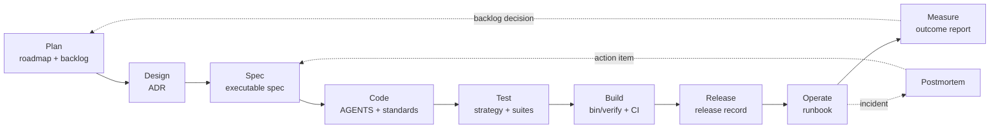

# Project Development Flow

**Tags:** [#development](tags.md#development) [#process](tags.md#process) [#governance](tags.md#governance) [#verification](tags.md#verification) [#communication](tags.md#communication) [#slack](tags.md#slack)

This is the repository-specific application of the
[Markdown-based system development flow](system-development-flow-master.md). It
uses the controls this Rails monolith already has and names gaps honestly. A
template is not evidence that a phase happened; the completed artifact and its
gate are. Use the [Workflow Guide for All Roles](system-development-flow-role-guide.md)
to identify each role's entry point, artifact, skills, delegation boundary, and
handoff.

Slack participation in this lifecycle follows the
[Slack policy](slack.md): Slack carries links, signals, owners, and next
actions, while the repository remains the system of record.

For a concrete application of every phase, follow the
[Milestone 1 reliable-account-recovery example](examples/milestone-1-reliable-account-recovery.md).

## Lifecycle



## Phase Map

| Phase | Project Artifact | Accountable Human Role | Gate |
| --- | --- | --- | --- |
| Plan | `docs/roadmap.md`, `docs/backlog.json` | Product Owner | Baseline, owner, priority, dependency, and measurable success criterion exist |
| Design | `docs/decisions/adr-*.md` for consequential choices | Repository Owner / Tech Lead | Alternatives, consequences, and fitness functions are explicit |
| Spec | `docs/specs/spec-*.md` for Tier B/C behavior | Product or Spec Owner | Invariants and acceptance criteria map to tests |
| Code | `AGENTS.md`, `CLAUDE.md`, `docs/coding-standard.md` | Implementing Developer | Focused tests pass and the diff respects its risk tier |
| Test | `docs/test-strategy.md` and test suites | Human Reviewer / QA | Acceptance intent is human-owned; automated suites pass |
| Build | `config/ci.rb`, `.github/workflows/ci.yml` | Platform Owner | `bin/verify` and independent CI pass |
| Release | `docs/releases/release-*.md` | Release Owner | Approval, rollback, migration order, and post-release checks are ready |
| Operate | `docs/runbooks/rb-*.md` | On-call Owner | Runbook is executable; SLO/health evidence is reviewed |
| Measure | `docs/outcomes/outcome-*.md` | Product Owner | Actual outcome is compared with its target and creates a decision |

## Slack Engagement Layer

Slack connects people and actionable signals to this flow without becoming a
parallel workflow. A message does not advance a phase, satisfy a gate, approve
a release, or preserve a decision. The linked repository artifact and its human
owner remain authoritative.

| Phase | Current or Planned Slack Use | Repository Authority |
| --- | --- | --- |
| Plan–Test | Use a `squad-academy` thread for an async question, blocker, review handoff, artifact link, or lifecycle status update such as `proposed → accepted`; keep ceremonies live as defined in `docs/process.md` | `docs/backlog.json`, ADR/spec files, the diff, and test evidence |
| Build | The independent GitHub Actions workflow may post one failed run on `main` to `academy-alerts`; do not post local `bin/verify` results or successful runs | GitHub Actions run, `config/ci.rb`, and `.github/workflows/ci.yml` |
| Release | Post a release link or failed-deploy P1 only after a real target and owner exist; never use Slack as the approval or deploy command surface | `docs/releases/release-*.md` and platform deployment record |
| Operate | Route actionable P0/P1 signals to `academy-alerts`; open `inc-YYYYMMDD-NN` for an active incident and export the durable timeline before archiving | `docs/runbooks/`, `docs/postmortems/`, monitoring/tracing evidence |
| Measure | Use at most a P2 digest linking an outcome report; product interpretation stays human-owned | `docs/outcomes/` and the resulting backlog decision |

Every human handoff message must identify the phase, artifact link, accountable
human, current state, and one next action. Automated messages must additionally
name severity and source. Never send credentials, student identifiers, profile
data, raw student work, or active reset links. `@Claude` is allowed only in
`squad-academy`; `academy-alerts` stays send-only so build logs and third-party
release notes cannot address an agent.

### Lifecycle Status Updates

Use `squad-academy` to announce a status transition that hands work to another
role—for example `draft → proposed`, `proposed → accepted`, `in_progress →
verification`, `verification → complete`, or `approved → released`. Apply this
order:

1. The accountable human makes or authorizes the transition in the repository.
2. The matching validation gate passes and the durable artifact or backlog
   update records the transition.
3. Slack mirrors the result with the artifact ID and link, `old → new` status,
   accountable human, evidence link, and one named next action.

A Slack post, reaction, button, slash command, or agent reply cannot change an
artifact status. The outbound automation only mirrors validated transitions
already committed to `main`; it never reads Slack or infers acceptance from
chat text.

```text
Status: ADR-0003 proposed → accepted
Owner: @repository-owner
Artifact: <repository link>
Evidence: <gate or review link>
Next: @implementer starts MAIL-004
```

Today, the CI failure sender and validated lifecycle-status mirror exist in
code. Both require `SLACK_BOT_TOKEN`; CI failures use `SLACK_CI_CHANNEL`, while
status handoffs use `SLACK_STATUS_CHANNEL`. The status mirror waits for all six
independent jobs on `main`, is non-blocking, and exposes only artifact IDs,
statuses, owners, repository links, and predefined next actions. Deploy,
uptime, error, and incident routing remain planned gaps, and inbound ChatOps is
explicitly prohibited. See [Slack adoption order](slack.md#7-adoption-order).

## Phase Skill Routes

Every phase links directly to the detailed skills that may be required. Select
the smallest task-relevant subset; a link does not mean every listed skill must
be loaded for every change. Skills that span phases are intentionally repeated.

| Phase | Detailed Skills |
| --- | --- |
| Plan | [Problem Framing](skills/skill-prod-001-problem-framing.md) · [Metric Design](skills/skill-prod-002-metric-design.md) · [User Research](skills/skill-prod-003-user-research.md) · [Prioritization](skills/skill-prod-004-prioritization.md) · [Written Communication](skills/skill-hum-001-written-communication.md) · [Async Collaboration](skills/skill-hum-004-async-collaboration.md) |
| Design | [Trade-off Analysis](skills/skill-arch-001-tradeoff-analysis.md) · [Boundary & Module Design](skills/skill-arch-002-boundary-design.md) · [Data Modeling](skills/skill-arch-003-data-modeling.md) · [Threat Modeling](skills/skill-arch-004-threat-modeling.md) · [API Design](skills/skill-code-002-api-design.md) · [Contract Testing](skills/skill-test-004-contract-testing.md) · [Observability Design](skills/skill-ops-001-observability-design.md) · [Written Communication](skills/skill-hum-001-written-communication.md) · [Decision Documentation](skills/skill-hum-002-decision-documentation.md) · [Async Collaboration](skills/skill-hum-004-async-collaboration.md) |
| Spec | [Spec Writing](skills/skill-spec-001-spec-writing.md) · [Invariant Identification](skills/skill-spec-002-invariant-identification.md) · [Ambiguity Detection](skills/skill-spec-003-ambiguity-detection.md) · [Data Modeling](skills/skill-arch-003-data-modeling.md) · [Test Design](skills/skill-test-001-test-design.md) · [Property-Based Thinking](skills/skill-test-002-property-thinking.md) · [Written Communication](skills/skill-hum-001-written-communication.md) · [Decision Documentation](skills/skill-hum-002-decision-documentation.md) · [Async Collaboration](skills/skill-hum-004-async-collaboration.md) |
| Code | [Language Proficiency](skills/skill-code-001-language-proficiency.md) · [API Design](skills/skill-code-002-api-design.md) · [Concurrency & Distributed Systems](skills/skill-code-003-concurrency.md) · [Boundary & Module Design](skills/skill-arch-002-boundary-design.md) · [Context Engineering](skills/skill-ai-001-context-engineering.md) · [Agent Output Verification](skills/skill-ai-002-agent-output-verification.md) · [Review at Scale](skills/skill-ai-003-review-at-scale.md) · [Agent Orchestration](skills/skill-ai-004-agent-orchestration.md) · [Written Communication](skills/skill-hum-001-written-communication.md) · [Review Feedback](skills/skill-hum-003-review-feedback.md) · [Async Collaboration](skills/skill-hum-004-async-collaboration.md) |
| Test | [Test Design](skills/skill-test-001-test-design.md) · [Property-Based Thinking](skills/skill-test-002-property-thinking.md) · [Test Data Management](skills/skill-test-003-test-data.md) · [Contract Testing](skills/skill-test-004-contract-testing.md) · [Agent Output Verification](skills/skill-ai-002-agent-output-verification.md) · [Written Communication](skills/skill-hum-001-written-communication.md) · [Async Collaboration](skills/skill-hum-004-async-collaboration.md) |
| Build | [CI/CD Engineering](skills/skill-bld-001-cicd-engineering.md) · [Supply Chain Security](skills/skill-bld-002-supply-chain-security.md) · [Written Communication](skills/skill-hum-001-written-communication.md) · [Async Collaboration](skills/skill-hum-004-async-collaboration.md) |
| Release | [Release Risk Assessment](skills/skill-bld-003-release-risk-assessment.md) · [Database Operations](skills/skill-bld-004-database-operations.md) · [Written Communication](skills/skill-hum-001-written-communication.md) · [Async Collaboration](skills/skill-hum-004-async-collaboration.md) |
| Operate | [Observability Design](skills/skill-ops-001-observability-design.md) · [Incident Response](skills/skill-ops-002-incident-response.md) · [Root Cause Analysis](skills/skill-ops-003-root-cause-analysis.md) · [Production Debugging](skills/skill-code-004-production-debugging.md) · [Written Communication](skills/skill-hum-001-written-communication.md) · [Async Collaboration](skills/skill-hum-004-async-collaboration.md) |
| Measure | [Metric Design](skills/skill-prod-002-metric-design.md) · [Prioritization](skills/skill-prod-004-prioritization.md) · [Written Communication](skills/skill-hum-001-written-communication.md) · [Async Collaboration](skills/skill-hum-004-async-collaboration.md) |

The same person may wear several hats in this project, but accountability is
singular for each artifact. An AI agent may draft or implement; it is never the
accountable owner or release approver.

An external request for a new feature or an improvement enters Plan through
the [External Feature Proposal](templates/external-feature-proposal.md). It
does not become backlog work until a human Product Owner completes triage,
sanitizes the record, and assigns priority and ownership.

## Roadmap Methodology

This project uses **outcome-driven, dual-track Agile**. The
[product roadmap](roadmap.md) communicates direction as Now, Next, and Later;
it is not a promise to deliver a fixed feature list. Discovery reduces
uncertainty about the next outcome while Delivery produces one verified,
user-visible increment for the current outcome.

| Layer | Method | Evidence |
| --- | --- | --- |
| Direction | Outcome-based Now / Next / Later roadmap | Affected user, baseline, target, and guardrail |
| Discovery | Problem framing, opportunity mapping, and the smallest useful experiment | Research, assumptions, alternatives, and unresolved decisions |
| Prioritization | Dependency-aware Cost of Delay / WSJF | User value, time criticality, risk reduction or learning value, job size, and confidence |
| Delivery | Two-week increments and thin vertical slices | Demonstrable behavior, tests, and updated documentation |
| Governance | The risk-tier lifecycle gates in this document | ADR/spec when required, `bin/docs`, `bin/verify`, and human review |
| Learning | Outcome review after release | Actual result, guardrails, and a continue/change/stop decision |

### Roadmap Decision Cycle

1. **Frame the problem.** Identify the affected user, current behavior,
   baseline, impact, and explicit non-goals before discussing a solution.
2. **Define the outcome.** Choose one primary metric, at least one guardrail,
   the data source, target, and evaluation window. An output such as “feature
   shipped” is not an outcome.
3. **Explore options.** Compare a feature with at least one smaller or
   non-feature alternative, and select the smallest experiment that can reduce
   the most important uncertainty.
4. **Order the work.** Respect dependencies first, then compare Cost of Delay
   with job size. A useful relative score is `(user value + time criticality +
   risk reduction or learning value) / job size`; its inputs and confidence
   must remain visible because the number is not objective truth.
5. **Deliver a vertical slice.** Take one ready item through Design, Spec when
   required, Code, Test, and Build without opening parallel implementation
   work that depends on an unresolved decision.
6. **Measure and adapt.** Compare the actual outcome and guardrails with their
   targets, then have the Product Owner decide to continue, expand, change, or
   stop. Record the decision in the roadmap, backlog, and outcome report when
   applicable.

Dependencies, security requirements, and institutional decisions may override
a numerical priority score. Every accepted item must also state the
opportunity cost: which other work moves later because this item moves now.

### Discovery and Delivery Capacity

A starting planning heuristic is 70% of capacity for the current milestone,
20% for production hardening and risk reduction, and 10% for discovery of the
next milestone. The Product Owner and Engineering Manager may change this mix,
but they must keep WIP explicit and avoid treating every request as priority 1.

For the current roadmap, this means:

- unblock Milestone 1 through the human email-provider and credential-owner
  decision;
- use Milestone 2 as one bilingual vertical slice that validates the content
  model before scaling it across Milestone 3;
- establish course-specific curriculum data in Milestone 4 before deriving the
  real knowledge map in Milestone 5;
- leave Milestones 6–8 in Later until their institutional or teaching-policy
  decisions have named owners; and
- include the relevant Milestone 9 hardening work in every increment rather
  than postponing all operational risk to the end.

The [Problem Framing](skills/skill-prod-001-problem-framing.md) and
[Prioritization](skills/skill-prod-004-prioritization.md) decisions are owned by
the human Product Owner. An agent may organize evidence and calculate a stated
scoring model, but it cannot choose the problem or priority. Agents may assist
with [Metric Design](skills/skill-prod-002-metric-design.md), while the Product
Owner and Data owner select and interpret the outcome metric.

## When an Artifact Is Required

- **ADR:** a difficult-to-reverse technology, architecture, dependency,
  security, data-model, or operating decision has a meaningful losing option.
- **Spec:** Tier B/C behavior spans multiple files, contains domain invariants,
  or would otherwise require the implementer to guess.
- **Release record:** any production deployment once a real deployment target
  exists; always for migrations or Tier C changes.
- **Runbook:** before operating a new production dependency or recovery path.
- **Postmortem:** after a user-impacting incident or a material near miss.
- **Outcome report:** after a roadmap milestone or experiment reaches enough
  data to decide whether it succeeded.

Small Tier A changes and obvious one-file fixes do not need ceremonial
documents. They still need backlog traceability and the relevant gate.

## Definition of Ready

A change is ready to implement when:

- the user or business problem is stated;
- one human owner is named;
- scope and exclusions are explicit;
- Tier B/C invariants and acceptance criteria are verifiable;
- dependencies and unresolved decisions are identified;
- the risk tier is computed from touched paths, not from a description.

## While Building: Run the Feature's Tests

Run the tests that belong to the feature you are building, not the whole suite
after every edit. Which files those are is recorded, not guessed: a
specification's `enforced_by` names them, and `bin/rails test:spec[SPEC-0041]`
runs exactly those. See [test-strategy.md](test-strategy.md#run-tests-feature-by-feature).

The full suite is the gate at the end, not the loop in the middle — and it stays
the gate. Run `bin/verify` before pushing, and earlier than that whenever a
change touches shared chrome, navigation, layout, sessions, or anything another
feature reads.

## Definition of Done

A change is done when:

- the acceptance criteria have evidence;
- tests cover new behavior and protect affected invariants;
- `bin/verify` passes locally;
- independent CI passes before merge when a pull request is used;
- Thai and English content remain aligned;
- documentation and `docs/backlog.json` are current;
- when Slack was used, each handoff links the durable artifact and any decision
  has been copied into that artifact;
- a human has read the diff;
- release and outcome evidence is recorded when applicable.

## Traceability

```text
backlog item
  └── ADR / SPEC id
        └── commit trailer: Spec: SPEC-NNNN
              └── test path in enforced_by
                    └── release record
                          └── outcome report or postmortem
```

`bin/docs` verifies the connected project Markdown graph, skill metadata and
relationships, lifecycle-document schema, internal references, and paths.
`bin/verify` runs the complete local Rails gate. Neither tool decides whether a
product choice is correct; that remains a human responsibility.

Codex can apply the skill model through the repository-local
`.agents/skills/use-project-skill-library/` router. The router reads the
canonical index, loads only the detailed skill files needed for the current
phase, and preserves every `agent_delegable` boundary. It does not install or
modify user-level skills.

## Current Delivery Reality

The application now has a selected Render production target, an image-backed
service boundary, digest-based manual promotion, artifact evidence, and
deployment/recovery runbooks. Progressive delivery, feature-flag rollback,
operating SLOs, uptime/error monitoring, and a production alert route remain
outside this slice. The CI workflow contains a failed-`main` Slack sender,
but it sends nothing until repository credentials identify the workspace and
channel. Before the first application deployment, the release owner must add:

1. the Render registry credential and deploy-hook secret;
2. a verified immutable image digest, SBOM, signature, and provenance;
3. a tested database backup and restore runbook;
4. health checks and rollback criteria;
5. deployment ownership and credential custody;
6. an actionable alert route with a named on-call owner and linked runbooks.
