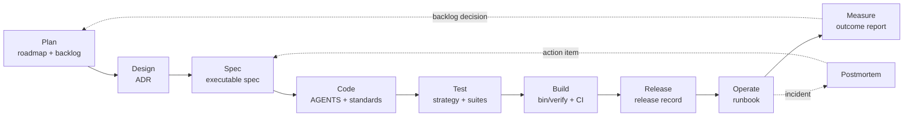

# Project Development Flow

**Tags:** [#development](tags.md#development) [#process](tags.md#process) [#governance](tags.md#governance) [#verification](tags.md#verification)

This is the repository-specific application of the
[Markdown-based system development flow](system-development-flow-en.md). It
uses the controls this Rails monolith already has and names gaps honestly. A
template is not evidence that a phase happened; the completed artifact and its
gate are.

## Lifecycle



## Phase Map

| Phase | Project Artifact | Accountable Human Role | Gate |
| --- | --- | --- | --- |
| Plan | `docs/roadmap.md`, `docs/backlog.json` | Product Owner | Baseline, owner, priority, dependency, and measurable success criterion exist |
| Design | `docs/decisions/adr-*.md` for consequential choices | Repository Owner / Tech Lead | Alternatives, consequences, and fitness functions are explicit |
| Spec | `docs/specs/spec-*.md` for Tier B/C behavior | Product or Spec Owner | Invariants and acceptance criteria map to tests |
| Code | `AGENTS.md`, `CLAUDE.md`, `docs/coding-standard.md` | Implementing Developer | Focused tests pass and the diff respects its risk tier |
| Test | `docs/test-strategy.md` and test suites | Human Reviewer / QA | Acceptance intent is human-owned; automated suites pass |
| Build | `config/ci.rb`, `.github/workflows/ci.yml` | Platform Owner | `bin/verify` and independent CI pass |
| Release | `docs/releases/release-*.md` | Release Owner | Approval, rollback, migration order, and post-release checks are ready |
| Operate | `docs/runbooks/rb-*.md` | On-call Owner | Runbook is executable; SLO/health evidence is reviewed |
| Measure | `docs/outcomes/outcome-*.md` | Product Owner | Actual outcome is compared with its target and creates a decision |

The same person may wear several hats in this project, but accountability is
singular for each artifact. An AI agent may draft or implement; it is never the
accountable owner or release approver.

## When an Artifact Is Required

- **ADR:** a difficult-to-reverse technology, architecture, dependency,
  security, data-model, or operating decision has a meaningful losing option.
- **Spec:** Tier B/C behavior spans multiple files, contains domain invariants,
  or would otherwise require the implementer to guess.
- **Release record:** any production deployment once a real deployment target
  exists; always for migrations or Tier C changes.
- **Runbook:** before operating a new production dependency or recovery path.
- **Postmortem:** after a user-impacting incident or a material near miss.
- **Outcome report:** after a roadmap milestone or experiment reaches enough
  data to decide whether it succeeded.

Small Tier A changes and obvious one-file fixes do not need ceremonial
documents. They still need backlog traceability and the relevant gate.

## Definition of Ready

A change is ready to implement when:

- the user or business problem is stated;
- one human owner is named;
- scope and exclusions are explicit;
- Tier B/C invariants and acceptance criteria are verifiable;
- dependencies and unresolved decisions are identified;
- the risk tier is computed from touched paths, not from a description.

## Definition of Done

A change is done when:

- the acceptance criteria have evidence;
- tests cover new behavior and protect affected invariants;
- `bin/verify` passes locally;
- independent CI passes before merge when a pull request is used;
- Thai and English content remain aligned;
- documentation and `docs/backlog.json` are current;
- a human has read the diff;
- release and outcome evidence is recorded when applicable.

## Traceability

```text
backlog item
  └── ADR / SPEC id
        └── commit trailer: Spec: SPEC-NNNN
              └── test path in enforced_by
                    └── release record
                          └── outcome report or postmortem
```

`bin/docs` verifies lifecycle-document schema, internal references, and paths.
`bin/verify` runs the complete local Rails gate. Neither tool decides whether a
product choice is correct; that remains a human responsibility.

## Current Delivery Reality

The application has no confirmed production target, progressive delivery,
feature-flag rollback, artifact signing, or operating SLOs. Release templates
therefore describe the required gate without claiming those controls currently
exist. Before the first application deployment, the release owner must add:

1. an immutable image tag tied to the Git commit;
2. an SBOM and vulnerability scan;
3. a tested database backup and restore runbook;
4. health checks and rollback criteria;
5. deployment ownership and credential custody.
