# Worked Development-Flow Example — Reliable Account Recovery

**Tags:** [#development](../tags.md#development) [#roadmap](../tags.md#roadmap) [#planning](../tags.md#planning) [#security](../tags.md#security)

> [Product Roadmap](../roadmap.md) ·
> [Project Development Flow](../development-flow.md) ·
> [Workflow Guide for All Roles](../system-development-flow-role-guide.md) ·
> [System Development Flow Master](../system-development-flow-master.md) ·
> [Skill Library](../skills-library-README.md)

This example applies the complete development flow to Roadmap Milestone 1. It
shows the artifacts, skills, gates, and handoffs without pretending that a
missing human decision has been made. It is a walkthrough, not an accepted ADR,
specification, provider selection, or release approval.

## Current Reality

| Field | Evidence |
| --- | --- |
| Roadmap outcome | A student who has added an email address can recover access in production |
| Current behavior | The reset workflow exists, but production email delivery is not configured |
| Current backlog item | `MAIL-001` — select the provider and credential owner |
| Current state | Blocked in Plan |
| Decision owner | Product Owner |
| Quantitative baseline | Not yet recorded; the Product Owner and Data owner must define it |
| Immediate next action | Select the provider, sending domain, from address, credential owner, and production host |

## Example Trace

```mermaid
flowchart LR
    P[MAIL-001<br/>Human provider decision] --> A[ADR<br/>provider and operating trade-offs]
    A --> S[Spec<br/>recovery invariants and acceptance criteria]
    S --> C[MAIL-002<br/>configuration and implementation]
    C --> T[Automated tests<br/>security + behavior]
    T --> B[bin/verify<br/>independent CI]
    B --> R[Release record<br/>rollback + secret custody]
    R --> O[Runbook<br/>delivery monitoring]
    O --> M[MAIL-003<br/>real-mailbox verification]
    M --> Q[Outcome report<br/>continue/change/stop]
```



## Phase 0 — Plan

**Accountable human:** Product Owner

**Artifact:** [roadmap](../roadmap.md) and `docs/backlog.json`

**Skills:** [Problem Framing](../skills/skill-prod-001-problem-framing.md),
[Metric Design](../skills/skill-prod-002-metric-design.md), and
[Prioritization](../skills/skill-prod-004-prioritization.md)

The Product Owner records this decision input:

```text
Email provider:
Sending domain:
From address:
Credential owner:
Production host:
Expected delivery volume:
Budget or contractual constraint:
Decision date and approver:
```

The agent may assemble alternatives and evidence. It may not choose the
provider, accept cost or privacy risk, assign credential custody, or mark
`MAIL-001` complete for the Product Owner.

**Exit gate:** the problem, owner, provider decision, measurable outcome,
guardrail, dependency, and opportunity cost are explicit.

## Phase 1 — Design

**Accountable human:** Repository Owner / Tech Lead

**Draft artifact:** [ADR-0002 — Select the Production Transactional-Email Provider](../decisions/adr-0002-select-production-email-provider.md)

**Skills:** [Trade-off Analysis](../skills/skill-arch-001-tradeoff-analysis.md),
[Threat Modeling](../skills/skill-arch-004-threat-modeling.md),
[Supply Chain Security](../skills/skill-bld-002-supply-chain-security.md), and
[Observability Design](../skills/skill-ops-001-observability-design.md)

The ADR should compare at least:

- authenticated SMTP versus a provider API;
- credential storage, rotation, and accountable owner;
- verified-domain and sender requirements;
- delivery-failure visibility and provider health signals;
- privacy, retention, regional, cost, quota, and lock-in implications;
- operational fallback and provider outage behavior.

**Exit gate:** one human-owned decision, meaningful alternatives, consequences,
threat considerations, and machine-checkable fitness functions are recorded.

## Phase 2 — Spec

**Accountable human:** Product / Spec Owner

**Planned artifact:** `docs/specs/spec-0001-production-account-recovery.md`

**Skills:** [Spec Writing](../skills/skill-spec-001-spec-writing.md),
[Invariant Identification](../skills/skill-spec-002-invariant-identification.md),
[Ambiguity Detection](../skills/skill-spec-003-ambiguity-detection.md), and
[Test Design](../skills/skill-test-001-test-design.md)

Candidate invariants for human acceptance:

1. A reset request must not reveal whether the submitted address belongs to an
   account.
2. A token must expire and must not authorize more than its intended reset.
3. A successful reset must invalidate the user's existing sessions.
4. Provider credentials must not enter source control, application responses,
   logs, or test fixtures.
5. Production links must use the approved HTTPS host.
6. Delivery failure must be visible to operators without exposing message
   content or unnecessary personal data.

Example acceptance evidence:

| Criterion | Verification |
| --- | --- |
| Known and unknown addresses receive indistinguishable public responses | Controller/request test |
| Expired or reused tokens fail safely | Password and token tests |
| A successful reset revokes existing sessions | Authentication integration test |
| Production URL and sender configuration match the accepted decision | Configuration test and release review |
| Delivery errors produce an operator-visible, privacy-safe signal | Integration test and runbook exercise |
| A real message reaches a controlled mailbox | Human production verification in `MAIL-003` |

**Exit gate:** a human accepts scope, invariants, non-goals, and acceptance-test
intent before implementation begins.

## Phases 3–5 — Code, Test, and Build

This is Tier C work because it touches authentication, sessions, secrets, and
production delivery configuration.

| Phase | Responsible role | Agent contribution | Gate |
| --- | --- | --- | --- |
| Code | Backend Engineer | Implement the accepted configuration and behavior, update focused tests and documentation, and state assumptions | Every touched line is reviewed; focused tests pass |
| Test | QA / Human Reviewer | Draft lower-level tests and collect evidence | Human-owned acceptance intent, failure paths, and affected suites pass |
| Build | DevOps / Platform | Prepare CI/configuration changes and analyze failures | `bin/docs`, `bin/verify`, and independent CI pass |

Relevant implementation skills are
[Language Proficiency](../skills/skill-code-001-language-proficiency.md),
[Context Engineering](../skills/skill-ai-001-context-engineering.md),
[Agent Output Verification](../skills/skill-ai-002-agent-output-verification.md),
[Test Data Management](../skills/skill-test-003-test-data.md), and
[CI/CD Engineering](../skills/skill-bld-001-cicd-engineering.md).

Do not place a real password, API token, mailbox credential, production address,
or student record in the repository or agent context.

## Phase 6 — Release

**Accountable human:** Release Owner

**Artifact:** `docs/releases/release-*.md`

**Skills:** [Release Risk Assessment](../skills/skill-bld-003-release-risk-assessment.md)
and [Database Operations](../skills/skill-bld-004-database-operations.md) when a
data change is actually required.

The release record identifies the immutable revision, credential owner,
configuration preconditions, rollback procedure, and post-release mailbox
check. An agent may draft the record but may not set it to `approved`.

## Phase 7 — Operate

**Accountable human:** SRE / On-call Owner

**Artifact:** `docs/runbooks/rb-*.md`

**Skills:** [Observability Design](../skills/skill-ops-001-observability-design.md),
[Incident Response](../skills/skill-ops-002-incident-response.md), and
[Root Cause Analysis](../skills/skill-ops-003-root-cause-analysis.md)

The runbook should answer:

- how to distinguish an application failure from a provider failure;
- which privacy-safe delivery, error, latency, and queue signals to inspect;
- who owns provider escalation and credential rotation;
- how to disable or roll back delivery safely; and
- how to verify recovery after mitigation.

**Exit gate:** a controlled failure produces the expected signal and reaches
the accountable operator.

## Phase 8 — Measure

**Accountable human:** Product Owner

**Artifact:** `docs/outcomes/outcome-*.md`

**Skills:** [Metric Design](../skills/skill-prod-002-metric-design.md) and
[Prioritization](../skills/skill-prod-004-prioritization.md)

The Product Owner and Data owner must finalize definitions and targets. A
starting measurement set is:

- primary outcome: proportion of valid recovery attempts that complete within
  the agreed evaluation window;
- operational metric: accepted, delivered, bounced, and failed messages by
  provider status without message content or direct identifiers;
- guardrails: account-enumeration behavior remains indistinguishable, token and
  session invariants remain enforced, and support burden does not increase.

The human Product Owner interprets the result and records a continue, change,
or stop decision. A delivery count alone does not prove that account recovery
improved.

## Current Handoff

```text
Phase: Plan
Accountable human: Product Owner
Responsible roles: Product Owner with Architecture, Security, Platform, and Operations consulted
Artifact: docs/roadmap.md and docs/backlog.json
Required skills: SKILL-PROD-001, SKILL-PROD-002, SKILL-PROD-004
Decision made: None
Evidence: MAIL-001 is blocked
Gate result: Not passed
Assumptions and residual risk: No provider, credential owner, or quantitative baseline is approved
Next role and next action: Product Owner selects and records the production email arrangement
```

After that decision, an agent can be asked to draft the ADR and specification
using the accepted values—without receiving the credentials themselves.
