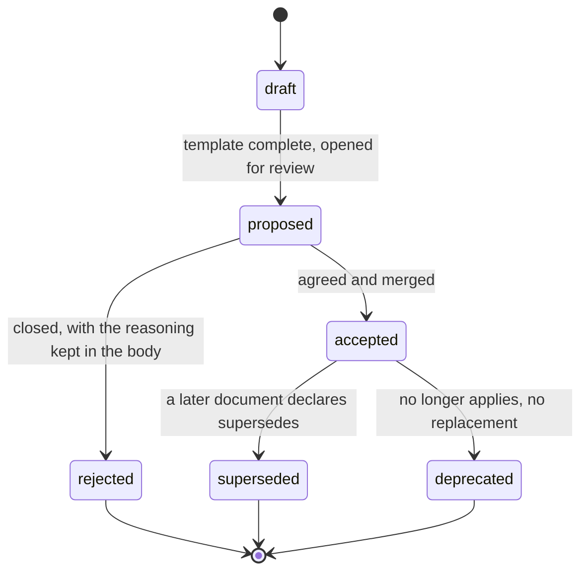

---
---

# Markdown as the development life cycle

**Tags:** [#documentation](tags.md#documentation) [#governance](tags.md#governance) [#decisions](tags.md#decisions)

**Docs-as-code, sized to this repo.** Every document that influences an engineering decision lives in this repository, changes in the same commit as the code it describes, and is reviewed under the same rules. The point is not that Markdown is readable — it is that **documentation inherits the governance already built for code**: git history, `git blame`, review on a diff, and a pipeline that can be made to fail.

> **Most of this file is a proposal, not a decision** — the same way sprint length is a proposal in `docs/process.md`. Section 1 is what the repo already does. Sections 3–6 are what it would do next, and nothing in them is wired up yet. Agree them as a team and edit this file; do not cite an unadopted section as though it were the rule.

## 1. What is already true

| Document | Is really | Governs |
| --- | --- | --- |
| `CLAUDE.md` | the architecture record, written as invariants and load-bearing notes rather than as numbered ADRs | how the code is built, and what may not be broken |
| `README.md` | the same ground for a human joining | setup, and the nine screens |
| `docs/process.md` | the Scrum process and the definition of done | cadence, and what "done" means |
| `docs/design-system.md` | the tokens, in prose, with the earlier port kept as history | anything visual |
| `docs/agent-flow.md` | the gates, the risk tiers and the trust boundary for agent-written work | how a change gets verified |
| `docs/slack.md` | a notification policy written before there is an integration | what Slack may carry |
| `.claude/skills/` | five executable procedures | how to explore, debug, refactor, review and run |

Three rules already operate here, and they are the whole of the current life cycle:

- **A document has one thing that wins over it.** `CLAUDE.md` loses to the code where they disagree; `design-system.md` loses to the `@theme` block; this file loses to `CLAUDE.md` on anything about the app, and governs only how documents themselves are written and retired.
- **`CLAUDE.md` and `README.md` must not drift** — an architectural change updates the matching README section in the same commit. That is the one coupling rule the project already states, and **nothing checks it**. It holds because two files are few enough to hold in a head, which is exactly the property that fails at ten.
- **History is kept, not deleted.** `process.md` keeps the finished dependency order struck through rather than removing it, and `design-system.md` keeps the eng.utcc.ac.th port as a history section. That is the *supersede, never delete* rule already in practice under another name.

## 2. Why write any of this down now

Because the two things that made the current arrangement work are both ending.

`process.md` says it plainly: the dependency order is complete, so **the next backlog decision is a genuine one rather than a reading of a list**. A genuine decision is exactly the thing that needs a record of what was chosen and what was traded away — and there is no place to put one. `CLAUDE.md` holds the *outcomes* of a dozen such decisions (why the nonce is `SecureRandom`, why the broadcast pushes an empty frame, why the leaderboard is deferred rather than optimised) but not the alternatives that lost, and it cannot grow to hold them without becoming unreadable as a conventions file.

And an agent reads this repo constantly. `CLAUDE.md` is already loaded into every session; a decision that exists only in someone's memory of a meeting is a decision the agent will contradict, plausibly and confidently.

## 3. The artifact set — proposed

Deliberately shorter than the canonical taxonomy. **One document = one type = one question**; a document answering several questions is several files that link to each other.

| Type | Prefix | Lives in | Answers | Adopt when |
| --- | --- | --- | --- | --- |
| **ADR** — decision record | `adr-` | `docs/decisions/` | what was chosen, what was traded away | the next genuine backlog decision |
| **SPEC** — executable specification | `spec-` | `docs/specs/` | what to build, and how we will know it is done | the first item too large to hold in one sprint's head |
| **RUNBOOK** | `rb-` | `docs/runbooks/` | what to do when production breaks | before the first real deployment |
| **POSTMORTEM** | `pm-` | `docs/postmortems/` | what happened, and what stops it recurring | after the first incident, and not before |

**Not adopted, each for a reason:**

- **PRD** — one product owner, one classroom, and `process.md` already holds "what is known to be wanted". A PRD here would be a second backlog that disagrees with the first.
- **RFC** — an ADR with `status: proposed` is the same document. Two names for one state is how a taxonomy starts rotting.
- **CHANGELOG** — the commit log is honest and nothing consumes a version number; there are no releases, only deploys.
- **GUIDE** — `CLAUDE.md`, `README.md` and `design-system.md` are the guides. Adding a `gd-` prefix in front of files that already exist and already say which one wins buys nothing.

**The folders stay flat inside `docs/`, with no numeric lifecycle prefixes.** Four directories sort fine alphabetically, and a `10-`/`20-` scheme is a solution to a problem this repo does not have yet.

## 4. Frontmatter — proposed

YAML frontmatter is what a machine reads; the body is what a person reads. The schema is lean on purpose — **every field has to earn a place by being queried by something**, or it becomes a field everybody copies and nobody updates.

```markdown
---
id: ADR-0001
type: adr                    # adr | spec | runbook | postmortem
title: Defer the leaderboard board into a lazy frame
status: accepted             # draft | proposed | accepted | superseded | deprecated | rejected
owners: ["@chanthawat"]
created: 2026-07-28
updated: 2026-07-28
review_by: 2027-01-28        # staleness deadline, not an expiry
supersedes: []
superseded_by: []            # required once status is superseded
depends_on: []               # other document ids
implemented_by: ["71b487a"]  # commit shas — there are no PR numbers here
touches: ["app/controllers/leaderboards_controller.rb", "app/models/leaderboard.rb"]
enforced_by: ["test/controllers/leaderboard_frame_test.rb"]
agent_writable: true         # false means an agent may not edit the body
---
```

Four departures from the canonical schema, each deliberate:

- **`implemented_by` holds commit shas, not PR numbers.** Every one of the 46 commits landed directly on `main` — no branches, no merges. Four pull requests exist on the remote and all four are Dependabot's, closed rather than merged, so no change to this app has ever been described by a PR number. `git log` is the record.
- **`touches` holds paths, not service names.** One monolith, one Puma process — see "Software system design" in `CLAUDE.md`. Service names would be fiction.
- **`enforced_by` replaces the *Fitness Function* section**, and it is the single most important field here. A decision with no test behind it is a meeting record. This repo already has the pattern everywhere — `leaderboard_frame_test.rb` is why the frame cannot start fetching itself, `placeholder_content_test.rb` is why the positional locale joins cannot silently shift, `content_security_policy_test.rb` is why the nonce cannot quietly go missing. An ADR should name the test that keeps it true, and if it cannot name one, that absence is the first thing a reviewer should ask about.
- **`risk_tier` is dropped.** Tiers exist to route a document to different approvers. There is one team and no CODEOWNERS file, so a tier would sort documents into buckets that all get the same review.

## 5. Status is the only field with a rule



- **Never delete a document.** `superseded` or `deprecated`, always. The decision history is the asset — deleting the losing option is how a team repeats the mistake it already paid for once. `process.md` and `design-system.md` both already do this.
- **`superseded` requires a `superseded_by` that resolves.** A dangling pointer is worse than a stale document, because it reads as though the answer exists somewhere.
- **A past-due `review_by` changes nothing about status.** It marks the document stale in a report; renewing or deprecating it is a person's call.
- **An agent may draft, but never sets `accepted`.** That is the one rule here that must be enforced by tooling rather than by trust, because other things read status to decide what is current. In this repo it means `status` is set in a commit a human authored — there is no merge gate to hang it on, and pretending otherwise would be the same fiction as the PR numbers.

## 6. Gates — what would run, and where

There is now a GitHub Actions workflow (`.github/workflows/ci.yml`) running the same steps as `bin/ci`, but the canonical ten-gate documentation pipeline still does not apply: it is one repo, one team, and the checks below are cheap enough to belong in the run everyone already waits for. If document checks are adopted, they are a step in `config/ci.rb` — and therefore in the workflow too, since the two must not drift:

```ruby
step "Docs: Frontmatter and references", "bin/docs"
```

Worth building, in this order:

| | Checks | On failure |
| --- | --- | --- |
| **D1 Schema** | frontmatter parses and matches its type | fail the step |
| **D2 References** | `depends_on`, `supersedes`, `superseded_by` name ids that exist | fail the step |
| **D3 Enforcement** | every `enforced_by` path exists, and every `touches` path exists | fail the step |
| **D4 Staleness** | `review_by` is past due | report, never fail |

Deliberately **not** worth building here: prose linting (one writer, and Vale would fight the voice these documents are written in), external link checking (a handful of links, and a flaky network failing `bin/ci` teaches people to skip the step), diagram rendering (`mermaid` blocks are few and reviewed on GitHub anyway), and secret scanning of `docs/` alone — Brakeman and `bundler-audit` already run, and the credentials in this project are encrypted rather than pasted.

**D3 is the gate that matters**, and it is the cheap version of the code-doc coupling rule the project already states but does not enforce. A path that stopped existing is a document describing an app that is gone.

## 7. What an agent should read, and when

The reason to do any of this in a repo that Claude Code works in daily.

- **`CLAUDE.md` is loaded every session and stays the entry point.** Nothing here displaces it. This file is read when the question is *how do we record a decision*, not *how does the app work*.
- **A document with `status: superseded` must never be cited as current.** This is the failure mode worth the whole schema: the output looks plausible, cites a real file, and is wrong, and nothing on screen catches it.
- **Select context by frontmatter, not by reading `docs/`.** `touches` and `enforced_by` are how a task narrows to the two or three documents that bear on it.
- **An agent may draft an ADR, a spec or a runbook, and may update a runbook after an incident.** It may not set `accepted`, may not edit a body marked `agent_writable: false`, and may not close a postmortem action item.
- **A decision an agent was blocked on belongs here.** `docs/agent-flow.md` §6 requires that an ambiguity is asked about rather than guessed, and that the answer is written into the repo rather than left in a session. Once that answer has a losing alternative worth keeping, an ADR is where it goes — which is the most likely source of the first one.

## 8. Adoption order

Do not migrate anything. Nothing currently in `docs/` becomes an ADR retroactively — `CLAUDE.md` is a better record of those decisions than a backfilled file would be, and a backfill with no author is how a staleness metric becomes meaningless on day one.

1. **Write the first ADR when the first genuine decision arrives** — most likely the mailer, or whether hearts gate anything at zero. One file, the frontmatter above, `docs/decisions/adr-0001-*.md`.
2. **Wait for three.** A schema written before there are three documents to fit it is a guess.
3. **Then build `bin/docs`** with D1–D3 and add the `config/ci.rb` step. Not before: a checker over one file is ceremony.
4. **Add a runbook before the first real deployment** — `config/deploy.yml` still points at a placeholder server, and the restore path for a Postgres volume — which accessory, which `pg_restore`, into which of the four databases — is exactly the thing nobody reconstructs at 3 a.m.
5. **Postmortems only after an incident.**

## The five that carry the rest

1. **Documentation inherits code's governance for free** — that, not readability, is the reason it lives here.
2. **Frontmatter matters more than prose** — the body is for people; the frontmatter is what keeps a corpus navigable and checkable.
3. **A document nothing checks is a document that is wrong** — you just do not know it yet.
4. **Never delete; supersede** — the decision history is the most expensive thing in the corpus.
5. **Status belongs to a person** — an agent drafts; `accepted` is granted.
