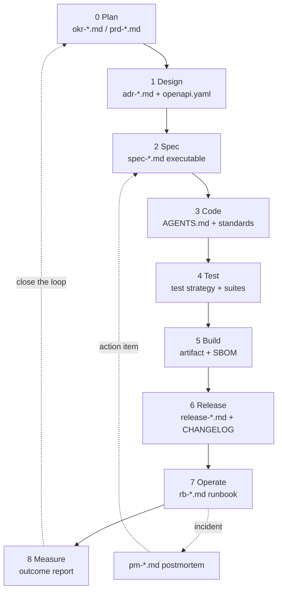

# System Development Flow — Markdown-Based
### Full Lifecycle: Plan → Design → Spec → Code → Test → Build → Release → Operate → Measure
### With a Complete Role Map and the Skills Required at Each Stage

> **Principle:** Every phase has a Markdown artifact stored in the repository, a machine-verifiable gate, and a clearly designated human owner.
> Each stage also specifies **which skills it requires**—because most flow problems do not come from a broken process, but from assigning work to someone who does not yet have the skills required for that stage.

---

# Part 1 — Flow Overview



## Master Table — Phase × Artifact × Gate × Skills

| # | Phase | Markdown Artifact | Input | Exit Gate | Core Skills Required |
| --- | --- | --- | --- | --- | --- |
| 0 | **Plan** | `okr-*.md`, `opp-*.md`, `prd-*.md` | User and business data | Measurable baseline + instrumentable success metric | Problem framing, Metric design, User research |
| 1 | **Design** | `adr-*.md`, `openapi.yaml`, `c4/*.mermaid` | PRD | Every ADR includes alternatives + fitness function | Trade-off analysis, Data modeling, Boundary design |
| 2 | **Spec** | `spec-*.md` | PRD + ADR | DoR: machine-verifiable invariants + ACs | Spec writing, Domain modeling, Test design |
| 3 | **Code** | `AGENTS.md`, `gd-coding-standard.md`, CODEOWNERS | Spec | Gate 1 self-verification passes | Language proficiency, API design, Context engineering |
| 4 | **Test** | `gd-test-strategy.md` | Spec ACs | Coverage policy + contract tests pass | Test design, Property thinking, Test data management |
| 5 | **Build** | `gd-build-pipeline.md`, SBOM | Code that passed the gate | Reproducible + signed + scanned | CI/CD, Supply chain security |
| 6 | **Release** | `release-*.md`, `CHANGELOG.md` | Artifact | Approval + rollback plan ready | Release engineering, Risk assessment |
| 7 | **Operate** | `rb-*.md`, `pm-*.md` | Running system | No SLO burn / postmortem complete | Observability, Incident response |
| 8 | **Measure** | Outcome report | Actual metrics | Compare results with PRD targets and decide | Data interpretation, Product judgment |

---

# Part 2 — Details of the Four Core Phases

## Phase 3 — Code

### Required Artifacts

`AGENTS.md` (at the repository root)—shared rules for both people and agents:

```markdown
# Working Agreement

## Branch & Commit
- trunk-based: branch lifetime < 2 days
- commit message: Conventional Commits (`feat:`, `fix:`, `refactor:`)
- commit trailer: `Spec: SPEC-PAY-1042` ← used to generate traceability automatically

## Prohibited
- Do not modify files in `tests/contract/` or `db/migrate/`
- Do not add a dependency without an ADR
- Do not catch exceptions broadly

## Required
- `bin/verify` must pass before opening a PR
- Business invariants must have DB constraints, not only application validation
- New code in Tier C modules must use strict type annotations
```

`gd-coding-standard.md`—guidance that a linter cannot enforce, such as when to extract a service object, how to name concepts in the domain language, and how to handle errors.

### Gate 1 — Self-Verification (Agents and People Use the Same Suite)

```bash
bin/verify   # lint → type check → unit test → security scan → diff size
```

**Principle:** If agents and humans use different verification scripts, the “it passes locally but fails in CI” situation will recur until everyone stops trusting the gate.

### Skills Required at This Stage

| Task | Skill | Level | What Happens If It Is Missing |
| --- | --- | --- | --- |
| Write the implementation | Language proficiency | Proficient | The code works but cannot be maintained |
| Design interfaces/APIs | API design | Proficient | Frequent breaking changes; downstream users suffer |
| Handle errors | Error handling design | Proficient | Errors disappear silently and cannot be debugged |
| **Direct agents effectively** | **Context engineering** | **Proficient** | Agents produce work that looks good but is wrong |
| Review agent output | Code reading at speed | Expert | Rubber-stamp reviews |

---

## Phase 4 — Test

### Test Pyramid and Ownership

| Level | Proportion | Owner | Can an Agent Write It? | Reason |
| --- | --- | --- | --- | --- |
| **Acceptance / Contract** | 5% | **Human (Spec Owner)** | ❌ No | It defines what “correct” means. If the agent writes it, the agent will optimize for passing its own test |
| **Integration** | 20% | Dev + Agent | ✅ Yes (human review) | Tests how components work together |
| **Unit** | 70% | Agent (primary author) | ✅ Fully | High-volume work with clear patterns |
| **E2E / System** | 5% | QA/SDET | ✅ Draft only | Brittle and slow; use only when necessary |

`gd-test-strategy.md`:

```markdown
## Coverage Policy
| Module | Line | Branch | Mutation |
|---|---|---|---|
| Tier C (money/auth/data) | ≥ 95% | ≥ 90% | ≥ 80% |
| Tier B | ≥ 80% | ≥ 70% | — |
| Tier A | — | — | — |

## Test Data
- Do not use production data containing PII, even if it has been masked
- Use deterministic factories + seeds (fixed seed)

## Flaky Test Policy
- A test that flakes ≥ 2 times in 30 days → quarantine immediately + create a ticket
- Do not use automatic retries to hide flakiness
```

**A flaky-test policy matters more than most people realize in the agent era**—because suites run repeatedly inside an agent’s self-verification loop. An unstable test can make the agent repeatedly “fix” code that is not broken, continuously burning cost.

### Skills Required at This Stage

| Task | Skill | Level | What Happens If It Is Missing |
| --- | --- | --- | --- |
| Design acceptance criteria | **Test design** | **Expert** | ACs are tested but prove nothing |
| Define invariants | Property-based thinking | Expert | Bugs escape example-based tests |
| Manage test data | Test data management | Proficient | Tests pass because of accidental data conditions |
| Contract testing | API contract design | Proficient | Integrations break during deployment |

---

## Phase 5 — Build

### Four Principles

| Principle | Why | How to Verify |
| --- | --- | --- |
| **Reproducible** | Same build → byte-for-byte identical artifact | Build twice and compare hashes |
| **Immutable artifact** | What is tested = what is deployed | Never rebuild during deployment |
| **Traceable** | The artifact can be traced back to its commit + spec | Embed metadata in the artifact |
| **Verifiable** | Includes an SBOM + signature | Run `cosign verify` before deployment |

```yaml
# Specified by gd-build-pipeline.md and implemented by CI
steps:
  - lock dependency (lockfile committed)
  - build artifact (deterministic, no timestamp)
  - generate SBOM (syft → CycloneDX)
  - scan SBOM (grype / trivy) → block on Critical
  - sign artifact (cosign)
  - push to registry with immutable tag: <semver>-<git-sha>
  - record provenance (SLSA attestation)
```

**What is often overlooked:** An SBOM is not a compliance ritual. When agents can add dependencies faster than people can review them, the SBOM is the only thing that can answer “Which version of log4j do we have in our systems?” within minutes instead of days.

### Skills Required at This Stage

| Task | Skill | Level |
| --- | --- | --- |
| Design the pipeline | CI/CD engineering | Proficient |
| Manage dependencies and the supply chain | Supply chain security | Proficient |
| Manage artifacts and registries | Release engineering | Foundation |
| Speed up builds (cache layers) | Build optimization | Proficient |

---

## Phase 6 — Release

### Release Artifact

`release-2026-08-v2.14.0.md`:

```markdown
---
id: REL-2026-08-01
version: v2.14.0
type: release
status: approved         # planned | approved | released | rolled_back
risk_tier: C
includes: ["SPEC-PAY-1042", "SPEC-CAT-880"]
approvers: ["@tech-lead", "@product"]
deploy_strategy: canary
rollback: "kamal rollback v2.13.4 / flag order.cancel.v2 → off"
verify_after_deploy:
  - "checkout_completion_rate does not decrease by > 2% within 30 minutes"
  - "payment_error_rate < 1.5%"
---
## Changes
(generated from commits containing the `Spec:` trailer)

## Migration
- [ ] expand: add the column (deploy first)
- [ ] migrate: backfill
- [ ] contract: remove the old column (next release)

## Rollback Plan
## Post-release Verification
```

### Deployment Strategy by Risk

| Tier | Strategy | Rollback | Who Pushes the Button |
| --- | --- | --- | --- |
| A | Rolling | Automatic | Automatic |
| B | Canary 10% → 50% → 100% | Automatic on SLO burn | Dev |
| C | Canary + feature flag + manual gate | Turn the flag off immediately | Tech Lead + On-call together |

**A rule that should never be relaxed:** Schema changes and code changes must always be deployed separately (expand → migrate → contract), because combining them is the leading cause of downtime that cannot be rolled back.

### Skills Required at This Stage

| Task | Skill | Level | What Happens If It Is Missing |
| --- | --- | --- | --- |
| Assess release risk | Risk assessment | Expert | Dangerous changes are released without recognizing the risk |
| Design rollback | Release engineering | Proficient | The rollback does not actually work when needed |
| Perform multi-phase migrations | Database operations | Expert | Downtime / data loss |
| Decide to roll back during an incident | Incident judgment | Expert | Hesitation allows the damage to escalate |

---

# Part 3 — Role Map

## All Roles in the System

| Role | Artifact Owner | Decisions | Most Relevant Phases |
| --- | --- | --- | --- |
| **Product Owner** | `prd-*.md`, outcome report | Scope, priority, whether the outcome succeeded | 0, 8 |
| **Business Analyst** | `opp-*.md`, requirement details | Interpretation of business needs | 0, 2 |
| **UX Designer** | Flow, prototype, `gd-ux-*.md` | User experience | 0, 1 |
| **Software Architect / Tech Lead** | `adr-*.md`, `package.yml`, fitness function | Structure, boundaries, technology choices | 1, 2, 3 |
| **Backend Engineer** | Code, unit/integration tests | How to implement | 3, 4 |
| **Frontend Engineer** | Code, components, accessibility | How to implement the UI | 3, 4 |
| **QA / SDET** | `gd-test-strategy.md`, acceptance tests | What counts as “passing” | 2, 4 |
| **DevOps / Platform** | `gd-build-pipeline.md`, IaC | Pipeline, environment | 5, 6 |
| **SRE / On-call** | `rb-*.md`, SLO, alerts | Rollback, escalation | 6, 7 |
| **Security Engineer** | Threat model, policy gates | What cannot be released | 1, 3, 5 |
| **Data Engineer/Analyst** | Metric pipeline, dashboard | Accuracy of the numbers | 0, 8 |
| **Engineering Manager** | Capacity, WIP limit | Resource allocation, removing bottlenecks | Every phase |
| **Agent Orchestrator** | `AGENTS.md`, budget, tool scope | What agents are allowed to do | 2, 3 |
| **AI Agent** | *(owns nothing)* | *makes no decisions* | 3, 4 (production work) |

**Important observation:** The AI Agent never appears as an “artifact owner” or under “decisions.” It is productive capacity, not an accountable party. Everything it produces must have a formally designated human owner.

## RACI by Phase

`R` = Responsible for doing the work · `A` = Accountable for the outcome (exactly one person) · `C` = Consulted · `I` = Informed

| Phase | PO | BA | UX | Arch | BE/FE | QA | DevOps | SRE | Sec | Data | EM |
| --- | --- | --- | --- | --- | --- | --- | --- | --- | --- | --- | --- |
| 0 Plan | **A/R** | R | C | C | I | C | I | I | C | R | I |
| 1 Design | C | C | R | **A/R** | C | C | C | C | **C** | I | I |
| 2 Spec | A | R | C | C | C | **R** | I | I | C | I | I |
| 3 Code | I | I | I | C | **A/R** | C | I | I | C | I | I |
| 4 Test | I | I | I | I | R | **A/R** | I | I | C | I | I |
| 5 Build | I | I | I | C | C | I | **A/R** | C | **C** | I | I |
| 6 Release | C | I | I | C | R | C | R | **A** | I | I | I |
| 7 Operate | I | I | I | C | C | I | R | **A/R** | C | I | I |
| 8 Measure | **A/R** | R | I | I | I | I | I | I | I | **R** | C |

**Reading across the table shows Security as `C` in seven phases**—security that appears only as a final gate arrives too late. It must be involved from the Design phase onward.

---

# Part 4 — Skills Matrix

## 4.1 Required Skills by Category

| Category | Skill | Used in Phase | Required Level | Status in the Agent Era |
| --- | --- | --- | --- | --- |
| **Product** | Problem framing | 0 | Expert | ⬆️ More important |
| | Metric design | 0, 8 | Proficient | ⬆️ |
| | User research | 0 | Proficient | → Unchanged |
| | Prioritization | 0 | Expert | ⬆️ |
| **Architecture** | Trade-off analysis | 1 | Expert | ⬆️⬆️ Much more important |
| | Boundary/module design | 1, 3 | Expert | ⬆️⬆️ |
| | Data modeling | 1, 2 | Expert | ⬆️ |
| | Threat modeling | 1 | Proficient | ⬆️ |
| **Specification** | **Spec writing** | 2 | **Expert** | ⬆️⬆️⬆️ **Most important** |
| | Invariant identification | 2 | Expert | ⬆️⬆️ |
| | Ambiguity detection | 2 | Expert | ⬆️⬆️ |
| **Coding** | Language proficiency | 3 | Proficient | ⬇️ Less important |
| | Boilerplate/CRUD | 3 | Foundation | ⬇️⬇️ Much less important |
| | API design | 1, 3 | Proficient | → |
| | Concurrency/distributed systems | 3 | Expert | ⬆️ |
| | Production debugging | 7 | Expert | ⬆️⬆️ |
| **Testing** | Test design | 2, 4 | Expert | ⬆️⬆️ |
| | Property-based thinking | 2, 4 | Proficient | ⬆️⬆️ |
| | Writing unit tests | 4 | Foundation | ⬇️⬇️ |
| **Build/Release** | CI/CD engineering | 5 | Proficient | → |
| | Supply chain security | 5 | Proficient | ⬆️ |
| | Release risk assessment | 6 | Expert | ⬆️ |
| | Database operations | 6 | Expert | ⬆️ |
| **Operations** | Observability design | 1, 7 | Proficient | ⬆️ |
| | Incident response | 7 | Expert | ⬆️⬆️ |
| | Root cause analysis | 7 | Expert | ⬆️⬆️ |
| **AI Era** | **Context engineering** | 3 | Proficient | 🆕 New |
| | **Agent output verification** | 3, 4 | **Expert** | 🆕 **New + very important** |
| | **Review at scale** | 3 | Expert | 🆕 |
| | Agent orchestration | 3 | Proficient | 🆕 |
| **Human** | **Written communication** | Every phase | **Expert** | ⬆️⬆️⬆️ |
| | Decision documentation | 1, 2 | Proficient | ⬆️⬆️ |
| | Review feedback | 3 | Proficient | ⬆️ |
| | Async collaboration | Every phase | Proficient | ⬆️ |

## 4.2 The Three Skills with the Highest Return Right Now

**1. Spec writing**—the ability to turn something ambiguous into something verifiable.
How to practice: Take an old requirement that was previously misunderstood and rewrite it with invariants + ACs that point to test files. Repeat 10 times.

**2. Agent output verification**—the ability to read 200 lines of code and identify where they diverge from the intent within 10 minutes.
How to practice: Ask an agent to write code for which you already know the correct answer, then find where it deviates. Learn to recognize where agents repeatedly make mistakes (empty-input edge cases, error paths, concurrency, and off-by-one errors at boundaries).

**3. Written communication**—when everything is Markdown and asynchronous, the ability to write so that others understand without follow-up questions becomes the skill that determines the entire team’s speed.
How to practice: Write an ADR and give it to someone who was not part of the discussion. If they ask more than two follow-up questions, it is not ready.

## 4.3 Skills That Are Declining in Value (but Cannot Be Eliminated)

Writing CRUD, boilerplate, basic unit tests, and memorizing syntax—agents can do these things better and faster.

**But a Foundation level is still required**, because if you cannot read the code an agent writes, you cannot verify it. If verification is impossible, this entire flow collapses. Someone who skips the experience of writing code entirely will never develop verification skills, because those skills are built from the experience of making coding mistakes yourself.

---

# Part 5 — Skill Gate by Task

This table answers the question, “Who should do this task?”

| Task | Minimum Skill | Can It Be Assigned to an Agent? | Result If Assigned to Someone Below the Required Skill Level |
| --- | --- | --- | --- |
| Write OKRs + baseline | Metric design (P) | ❌ | Unmeasurable goals; an entire quarter is wasted |
| Decide scope | Prioritization (E) | ❌ | Build something no one uses |
| Choose the technology stack | Trade-off analysis (E) | ❌ (may propose options) | Technical debt that is difficult to reverse |
| Design module boundaries | Boundary design (E) | ❌ | Coupling spreads throughout the repository within a month |
| Write specs + invariants | Spec writing (E) | ❌ (may draft) | The agent guesses → logic bugs that reviews fail to catch |
| Write acceptance tests | Test design (E) | ❌ | Tests pass but prove nothing |
| Write CRUD / services | Language (F) | ✅ | — |
| Write unit tests | Test basics (F) | ✅ | — |
| Refactor within a defined scope | Language (P) | ✅ | — |
| Write migrations | Database ops (E) | ⚠️ May draft; a human must review the explanation | Downtime / data loss |
| Review Tier C | Verification (E) | ❌ | Rubber stamp → bugs reach production |
| Design the CI pipeline | CI/CD (P) | ⚠️ | Non-reproducible builds |
| Decide to roll back | Incident judgment (E) | ❌ | Hesitation allows damage to escalate |
| Write a postmortem | RCA (E) | ⚠️ May extract the timeline | Incorrect cause → repeated incident |
| Interpret outcome metrics | Product judgment (E) | ❌ | Wrong decision based on misread numbers |

*(F = Foundation, P = Proficient, E = Expert)*

---

# Part 6 — Small Teams: Who Wears Which Hats

| Team Size | Role Distribution | What to Watch Especially Closely |
| --- | --- | --- |
| **1 person** | Wears every hat | No one challenges decisions → use the agent as a “dissenter” and require it to argue against its own design before implementation |
| **2–3 people** | One person focuses on product + spec; another on architecture + release | Do not let the same person write a spec and then review work produced from that spec |
| **4–8 people** | QA/SDET is the first additional specialist to hire | The bottleneck immediately shifts to review—set a WIP limit before it feels necessary |
| **9+ people** | Begin separating Platform/DevOps | Conway’s law starts to have a real effect—the team structure becomes the system structure |

**Duties that require independent review—or explicit temporal separation in a one-person team:**

- Acceptance-test review must be independent from implementation. If one person must perform both duties, the test must be written **first** and must not be modified merely to accommodate the implementation.
- Tier C release approval must be independent from implementation. If working alone, wait at least one day, review from a clean context, and record the exception.

---

# Part 7 — Anti-Patterns

| Anti-Pattern | Consequence | Remedy |
| --- | --- | --- |
| Assign work by job title instead of skill | A senior person who has never written a spec produces one that leaves the agent guessing | Use the Skill Gate table |
| Everyone owns every artifact | No one truly owns anything | One `A` in the RACI for each phase |
| Security is only a final gate | Structural problems are discovered too late to fix | Security is `C` starting from Design |
| The agent writes the tests and then implements against its own tests | The system certifies itself | Put acceptance tests under CODEOWNERS |
| Rebuild during deployment | What is tested ≠ what is deployed | Use immutable artifacts |
| Combine schema and code changes | Downtime that cannot be rolled back | Expand → migrate → contract |
| Leave flaky tests unresolved | The agent repeatedly fixes code that is not broken, burning cost | Quarantine immediately after the second flaky occurrence |
| Do not close the measurement loop | The entire flow becomes a ritual | Require an outcome report after release |

---

## Summary of the Six Principles

1. **Every phase has a Markdown artifact in the repository and a machine-verifiable gate**—otherwise, it is only a diagram on a slide.
2. **Each phase has exactly one owner (`A`)**—distributed accountability is no accountability.
3. **Assign work by skill, not by title**—the Skill Gate table matters more than the org chart.
4. **Agents do not own any artifacts**—they are productive capacity, not accountable parties.
5. **The fastest-rising skills are spec writing, verification, and written communication**—not coding.
6. **People still need to know how to code**—because verification skills can only be built from the experience of making coding mistakes yourself.
